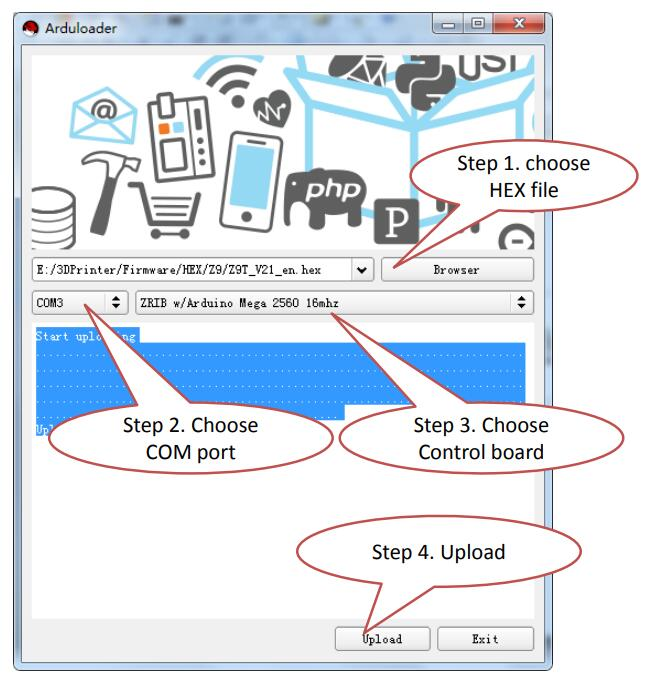
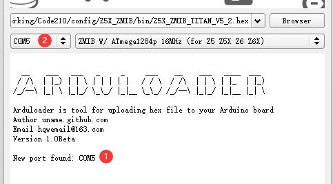

## Firmware upload steps:
:warning: Arduloader only can work on a PC with windows system (Win7/Win10/Win11) 
### 1. Download [**Arduloader.zip**](./Arduloader.zip) and unzip it to your PC.   
:warning: Copy the unzip Arduloader folder and firmware Hex file to a simple folder, which should not contain non English characters and spaces. If your machine username contains non English characters, do not copy it to the desktop. You can copy it to the root directory of any disk.
### 2. Connect the 3d printer to PC by USB cable. 
:warning: Pay attention to watch the window below in Arduloader when connecting the USB cable to the PC, it will show a message with a com port number,  that com port is exactly the port number for your control board.
### 3. Refer to the below steps to upload firmware to the control board.   

   

## FAQ
### Show "stk500v2_ReceiveMessage(): timeout" error 
   
1. Please connect the USB cable to control board and check if the com port showed on the arduloader message window,? If not, please check if the USB driver is installed well.
2. Choose the com port and upload firmware again. if the question is the same, try to change the com port number and reset your PC and try again.
[:movie_camera: How to change com port](./ChangeCOMPort.gif)