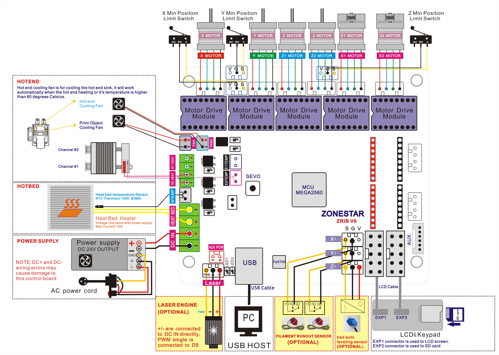

## M8R2 Firmware
#### :warning: M8S and M8R2 used the same firmware
- **:arrow_down: [M8R2 firmware V4.1: ZRIB control Board, Dual Extruder and Mix Color Hotend, LCD2004 with Knob](./M8R2_ZRIB_LCD2004KNOB.zip)**

----
## How to Upload Firmware
1. Download firmware upgrade tool: [:arrow_down:](https://github.com/ZONESTAR3D/Firmware/tree/master/Firmware_Upload_tool_for_ZRIB_ZMIB).
2. Download HEX file and copy the hex file to the same directory with the tool.   
3. Unzip "Arduloader.zip" , there is a user guide"Arduloader_user_guide.pdf" in this zip file, please read it. 
4. Connect the printer to your PC, please make sure the driver has been installed correctly. 
5. Follow "Arduloader_user_guide.pdf" to upload the firmware to your control board.

----
## :file_folder: [Firmware Source code](https://github.com/ZONESTAR3D/source-code-for-3d-printer)
Please refer to [**here**](https://github.com/ZONESTAR3D/source-code-for-3d-printer).
  
----
## Wiring Diagram
## M8S Wiring Diagram

## M8R2 Wiring Diagram

