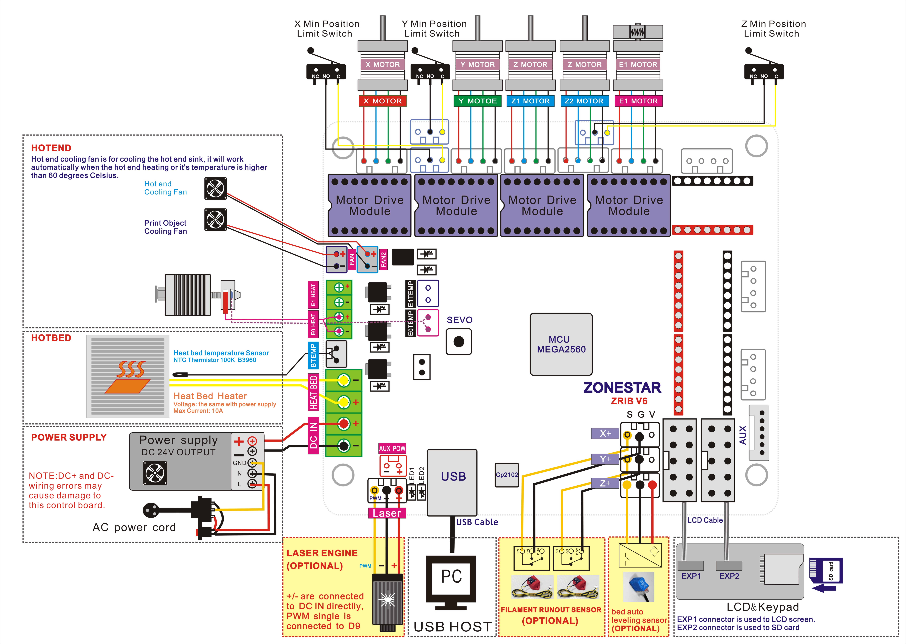
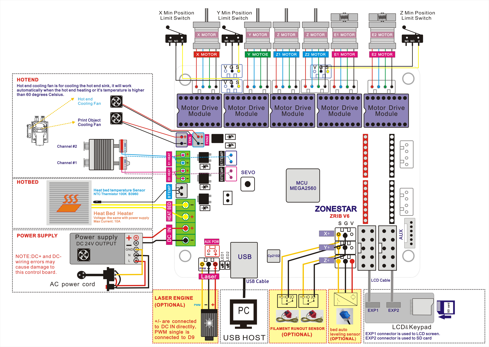

## Firmware
#### :warning: P802QSU can use the same firmware of P802QR2
### For Default P802QSU/P802QR2
- **:arrow_down: [Firmware V3: ZRIBV2 ~ ZRIBV6 control board, LCD2004 with 5 buttons Keypad](./P802QR2_ZRIBV6_LCD2004_5KEY_V3.zip)**
- **:arrow_down: [Firmware V3: ZRIBV2 ~ ZRIBV6 control board, LCD2004 with Knob](./P802QR2_ZRIBV6_LCD2004_KNOB_V3.zip)**
- **:arrow_down: [Firmware V4: ZRIBV2 ~ ZRIBV6 control board, LCD2004 with Knob](./P802QR2_ZRIBV6_LCD2004_KNOB_V4.zip)**
### P802QSU/P802QR2 upgraded BLTouch/3DTouch
- **:arrow_down: [ZRIBV2 ~ ZRIBV5 control board, LCD2004 with 5 buttons Keypad](./P802QR2_ZRIB_LCD2004_5KEY_BLTouch.zip)**
- **:arrow_down: [ZRIBV2 ~ ZRIBV5 control board, LCD2004 with Knob](./P802QR2_ZRIB_LCD2004_KNOB_BLTouch.zip)**
- **:arrow_down: [ZRIBV6 control board, LCD2004 with Knob](./P802QR2_ZRIBV6_LCD2004_KNOB_BLTouch.zip)**
### P802QSU/P802QR2 upgraded TMC2208 Motor drivers
- **:arrow_down: [ZRIBV6 control board, TMC220x Motor drivers](./P802QR2_ZRIBV6_TMC2208@ALL_LCD2004KNOB.zip)**
### P802QSU/P802QR2 upgraded 12864LCD
- **:arrow_down: [ZRIBV6 control board, Reprap 128x64 LCD screen](./P802QR2_ZRIBV6_REPRAPLCD12864_V4_2.zip)**
- **:arrow_down: [ZRIBV6 control board, ZONESTAR 128x64 LCD screen](./P802QR2_ZRIBV6_LCD12864_V4_2.zip)**
## Wiring Diagram
  
  

----
## How to Upload Firmware
1. Download firmware upgrade tool: [:arrow_down:](https://github.com/ZONESTAR3D/Firmware/tree/master/Firmware_Upload_tool_for_ZRIB_ZMIB).
2. Download HEX file and copy the hex file to the same directory with the tool.   
3. Unzip "Arduloader.zip" , there is a user guide"Arduloader_user_guide.pdf" in this zip file, please read it. 
4. Connect the printer to your PC, please make sure the driver has been installed correctly. 
5. Follow "Arduloader_user_guide.pdf" to upload the firmware to your control board.

----
## :file_folder: [Firmware Source code](https://github.com/ZONESTAR3D/source-code-for-3d-printer)
Please refer to [**here**](https://github.com/ZONESTAR3D/source-code-for-3d-printer).
