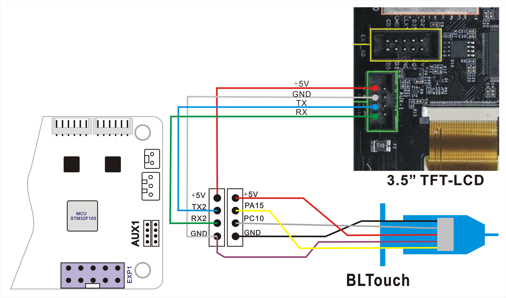
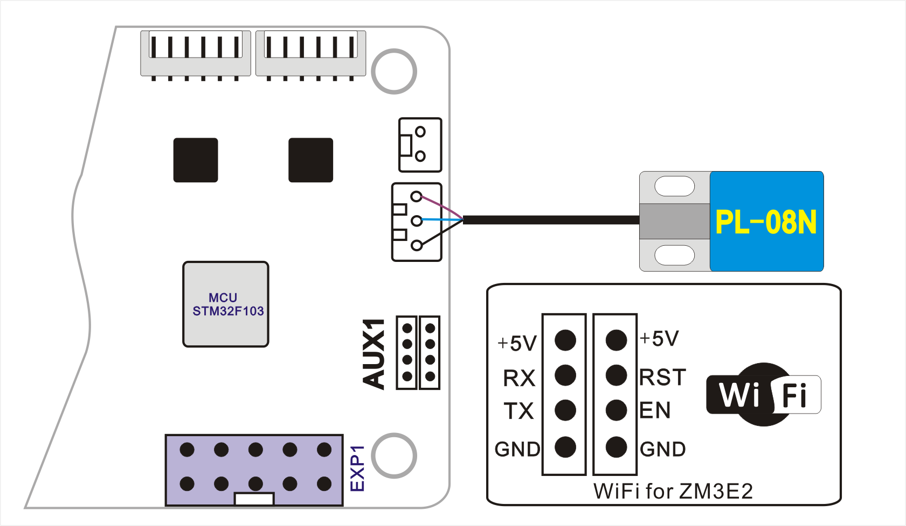

### Upload Steps:
1. Download the zip file and unzip it.
2. Copy firmware.bin to the root directoy of Micro-SD card.
3. Power off the printer and plug the Micro-SD card into sokect on control board.
4. Power on the printer, wait about 30 seconds.
5. Power off and power on the printer again.

-----
## Firmware
#### [:arrow_down: Z5S upgrade to ZM3E2 control board](./Z5S_ZM3E2_V1_2_0_en.zip)
#### [:arrow_down: Z5SM2 upgrade to ZM3E2 control board](./Z5SM2_ZM3E2_V1_2_0_en.zip)
#### [:arrow_down: Z5SR2 upgrade to ZM3E2 control board](./Z5SR2S_ZM3E2_V1_2_0_en.zip)
#### [:arrow_down: Z5SM2 upgrade to ZM3E2 control board and 3d Touch bed leveling sensor](./Z5SM2_ZM3E2_3DTouch_V1.zip)
#### [:arrow_down: Z5SM2 upgrade to ZM3E2 control board, Dual Gear Extruder and PL-08N bed leveling sensor](./Z5SM2_ZM3E2_BMGExtruder_PL08N_V1.zip)
#### [:arrow_down: Z5SM2 upgrade to ZM3E2 control board, Dual Gear Extruder, PL-08N bed leveling sensor and WiFi](./Z5SM2_ZM3E2_BMGExtruder_PL08N_WiFi_V1.zip)

## Wiring
### Upgraded ZM3E2 control board

### Upgraded ZM3E2 control board, 3d Touch bed leveling sensor (and 3.5" TFT_LCD screen)

### Upgraded WiFi (and PL-08N bed leveling sensor)

## :file_folder: [Firmware source code](./Sourcecode/)

-----
## Sales link:
- **[:gift: 3d touch](https://www.aliexpress.com/item/1005001464420529.html)**
- **[:gift: PL-08N - Choose "PL-08N 3V"](https://www.aliexpress.com/item/4000596309710.html)**
- **[:gift: WiFi Module - Choose "WiFi Module for ZM3E2"](https://www.aliexpress.com/item/1005002378551489.html)**