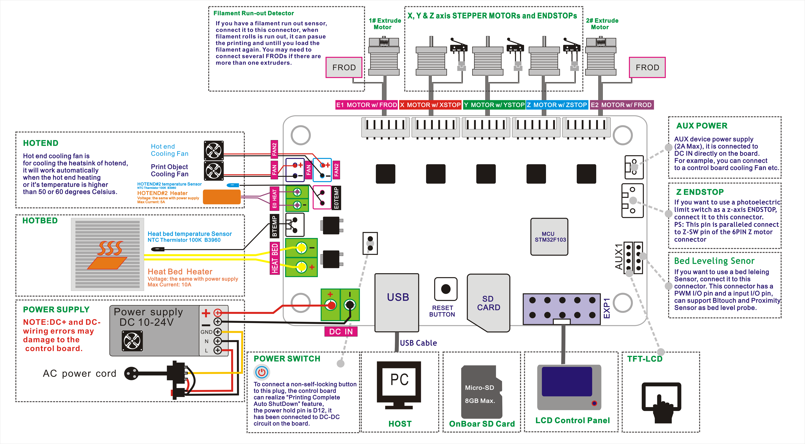
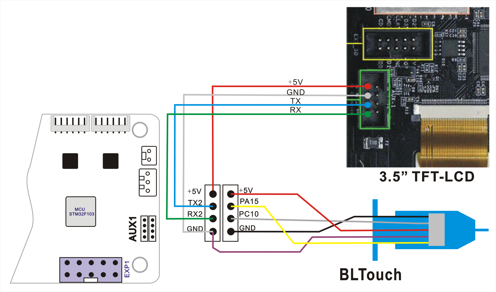
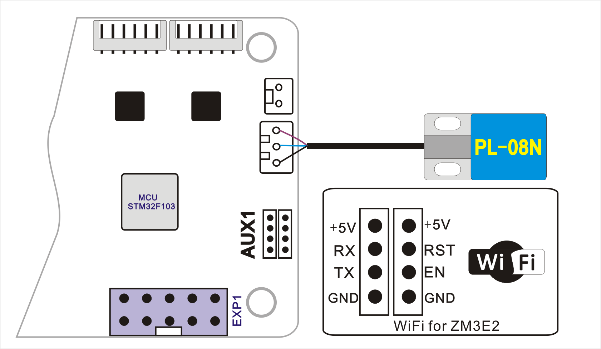

### Upload Steps:
1. Download the zip file and unzip it.
2. Copy firmware.bin to the root directory of Micro-SD card. :bulb: [*How to copy files to the root directory of an SD card*](https://techques.net/how-to-copy-a-file-to-the-root-of-an-sd-card/)      
NOTE: If there is a "old_fw.bin" in the SD card, delete it first.      
3. Power off the printer and plug the Micro-SD card into socket on control board.
4. Power on the printer and wait about 30 seconds.
5. Power off and power on the printer again.

-----
## Firmware
#### [:arrow_down: Z5X upgrade to ZM3E2 control board](./Z5X_ZM3E2_V1_2_0_en.zip)
#### [:arrow_down: Z5XM2 upgrade to ZM3E2 control board](./Z5XM2_ZM3E2_V1_2_0_en.zip)
#### [:arrow_down: Z5XR2S upgrade to ZM3E2 control board](./Z5XR2S_ZM3E2_V1_2_0_en.zip)
#### [:arrow_down: Z5X upgrade to ZM3E2 control board and 3d Touch bed leveling sensor](Z5X_ZM3E2_3DTouch_V1_3_0_beta.zip)
#### [:arrow_down: Z5XM2 upgrade to ZM3E2 control board and 3d Touch bed leveling sensor](./Z5XM2_ZM3E2_3DTouch_V1_4_0_beta.zip)
<!-- #### [:arrow_down: Z5XR2S upgrade to ZM3E2 control board and 3d Touch bed leveling sensor]() -->
#### [:arrow_down: Z5X upgrade to ZM3E2 control board, PL08N bed leveling sensor and WiFi](./Z5X_ZM3E2_PL08N_WiFi_V1_3_0_en.zip)
<!-- #### [:arrow_down: Z5XM2 upgrade to ZM3E2 control board and WiFi]() -->
<!-- #### [:arrow_down: Z5XR2 upgrade to ZM3E2 control board and WiFi]() -->
#### [:arrow_down: Z5X upgrade to ZM3E2 control board, Exchanged X and E2 connector, Portuguese Menu](./Z5X_ZM3E2_SWX&E2_V1_4_1.zip)
#### [:arrow_down: Z5X upgrade to ZM3E2 control board, 3d Touch bed leveling sensor, Exchanged X and E2 connector, Portuguese Menu](./Z5X_ZM3E2_SWX&E2_3DTouch_V1_3_0_PT.zip)

## Wiring
### Upgraded ZM3E2 control board

### Upgraded ZM3E2 control board, 3d Touch bed leveling sensor (and 3.5" TFT_LCD screen)

### Upgraded WiFi (and PL-08N bed leveling sensor)

-----
## Firmware source code
#### Firmware source code download link: https://github.com/ZONESTAR3D/source-code-for-3d-printer
#### Config file: https://github.com/ZONESTAR3D/source-code-for-3d-printer/tree/main/config/Z5X_ZM3E2

-----
## Sales link:
- **[:gift: 3d touch](https://www.aliexpress.com/item/1005001464420529.html)**
- **[:gift: PL-08N - Choose "PL-08N 3V"](https://www.aliexpress.com/item/4000596309710.html)**
- **[:gift: WiFi Module - Choose "WiFi Module for ZM3E2"](https://www.aliexpress.com/item/1005002378551489.html)**

