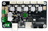
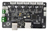

## [ZMIBV2](./ZMIBV2/)
Default the Z5X used a ZMIB control board, if you haven't upgraded the control board, use firmware in this directory.
## [ZM3E2](./ZM3E2/)
ZM3E2 is a 32-bits control baord, its dimensions are fully compatible with ZMIB, if you have upgrade the control board, use firmware in this directory.
