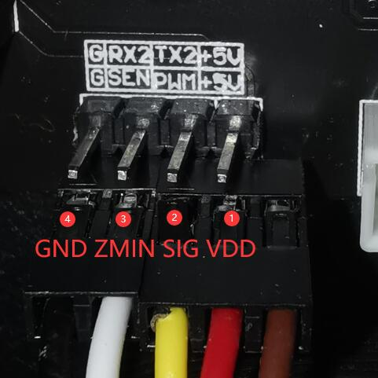

### Z6FB_3DTouch_V1_3_0 [:arrow_down:](./Z6FB_3DTouch_V1_3_0.zip)
### Wiring for 3DTouch
- Connect the 3DTcouh sensor to the AUX connector     

|  #        |  3DTouch  |Control Board|
|-----------|-----------|-------------|
|  1        |  VDD      |     +5V     |
|  2        |  SIG      |     PWM     |
|  3        |  ZMIN     |     SEN     |
|  4        |  GND      |     G(ND)   |

  
