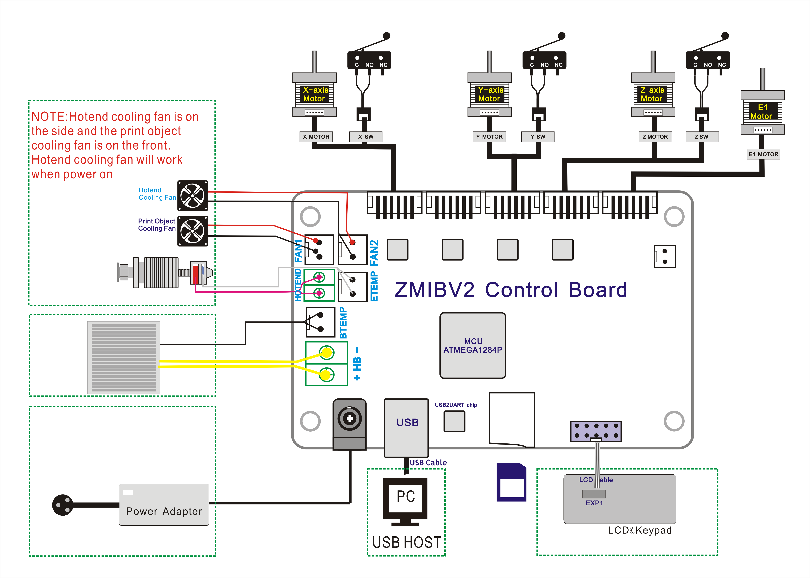

## Firmware for damaged motor driver
### Z6BS_XMFault
If the "X axis motor driver" of the control board is damaged, please upload this firmware to the control board and change the wiring.    
:arrow_down: [Download Firmware HEX file](./Z6BS_XMFault.zip)   
#### How to wiring
Exchange X axis motor connector to E0 motor connector and exchange E0 motor connector to E1 motor connector.    

-----
### Z6BS_YMFault 
If the "Y axis motor driver" of the control board is damaged, please upload this firmware to the control board and change the wiring.    
:arrow_down: [Download Firmware HEX file](./Z6BS_YMFault.zip)   
#### How to wiring
Exchange Y axis motor connector to E0 motor connector and exchange E0 motor connector to E1 motor connector.

-----
### Z6BS_ZMFault
If the "Z axis motor driver" of the control board is damaged, please upload this firmware to the control board and change the wiring.     
:arrow_down: [Download Firmware HEX file](./Z6BS_ZMFault.zip)   
#### How to wiring
Exchange Z axis motor connector to E0 motor connector and exchange E0 motor connector to E1 motor connector.    

-----
### Z6BS_EMFault
If the "Extruder motor driver" of the control board is damaged, please upload this firmware to the control board and change the wiring.        
:arrow_down: [Download Firmware HEX file](./Z6BS_EMFault.zip)   
#### How to wiring
Exchange E0 motor connector to E1 motor connector.    

