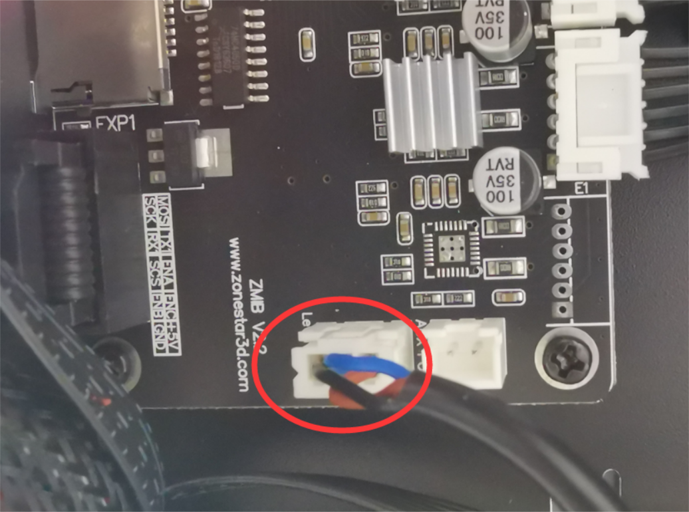
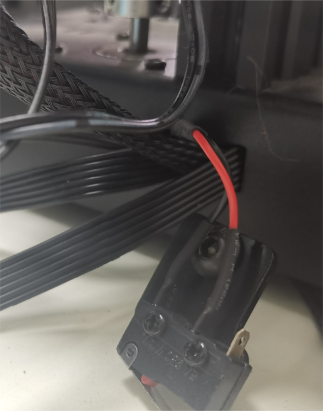
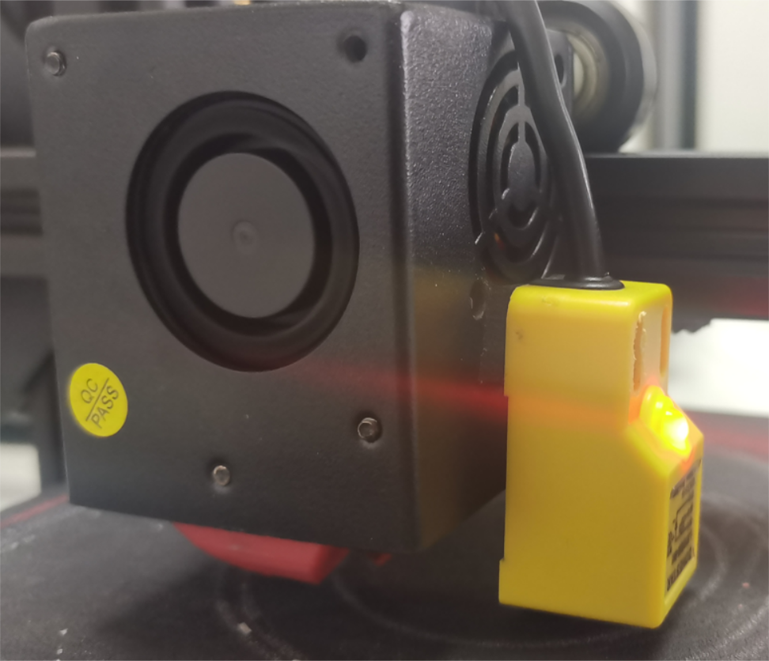
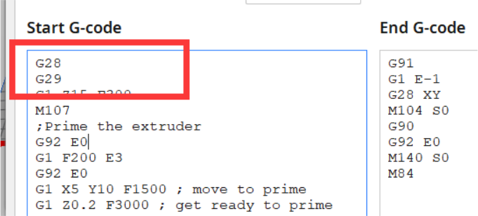

# Z6FB firmware with bed leveling sensor
## Introduction
If your control board is ZMIB V2.1 or V2.2, you can upgrade bed automatic leveling feature for your Z6 machine by [:gift:add a proximity sensor](https://www.aliexpress.com/item/2255800409994958.html).  
## Wiring
Refer to the below picture to wiring the probe.  

## Installtion
#### 1. Remove the Z ENDSTOP

#### 2. Refer to the below picture to install the probe to the right side of the hotend housing.  
:warning: The installation height of the sensor shall meet the following two conditions:
1. When the sensor works, the nozzle should be 1~3mm higher than the hot bed.
2. The sensor bottom shall be no less than 2mm higher than the nozzle.

## Upload firmware
1. Download the hex file [:arrow_down:](./HEX.zip).  
2. Upload the correct firmware to the control board. About how to upload firmware to the ZMIB control board, please refer to [***Here***](https://github.com/ZONESTAR3D/Firmware/tree/master/Firmware_Upload_tool_for_ZRIB_ZMIB)

## Set the Probe Z offset
#### :warning: After the following conditions is occured, you may need to adjust the "Probe Z offset":   
1. First time installation the probe or moved the probe position.    
2. Hot bed height adjustment.  
3. Hot bed sticker or the nozzle was replaced.  
4. Any other situations that may affect the height of the hot bed, the height and distance of the probe, and the height difference between the sensing point of the probe and the nozzle.
#### Steps to adjust the "Probe Z offset"
1. Clean the nozzle.
2. Menu>>Configration>>Restore Defaults.
3. Menu>>Motion>>Auto Home, wait it done.
4. Menu>>Motion>>Move Axis>>Move Z>>Move 0.1mm, rotate the knob and watch the nozzle, stop until the nozzle is touched the bed, remember the Z axis height. e.g. (1.8mm)
5. Menu>>Configration>>Probe Z Offset, set to -1.8mm.
6. Menu>>Configration>>Store Settings.  
:star2: After adjusted "Probe Z Offset", you need to do bed leveling again.

## Apply the bed auto leveling feature
There are two motheds to apply the bed auto leveling feature:  
#### Do bed leveling from the LCD screen  
Do the below steps:  
1. Motion>>Bed Leveling>>Auto Home.    
2. Motion>>Bed Leveling>>Level Bed.  
Then you can find the "Motion>>Bed Leveling>>Bed leveling:" show **ON**, it means the bed auto leveling is working.   
Then you can print some gcode file from SD card, it will do auto bed leveling automatically.
:warning: You need to do these steps again after the printer is reset (power off).  
#### Add a G29 command following the G28 command in the "start gcode" of slicing software.
Take Cura as an example, add G29 in the "Machine Settings>>Start Gcode".

 

