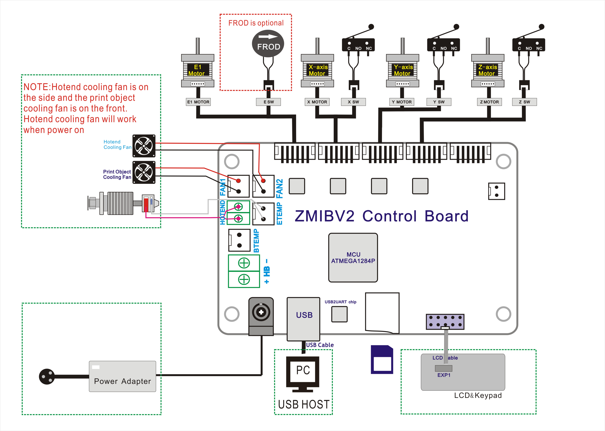
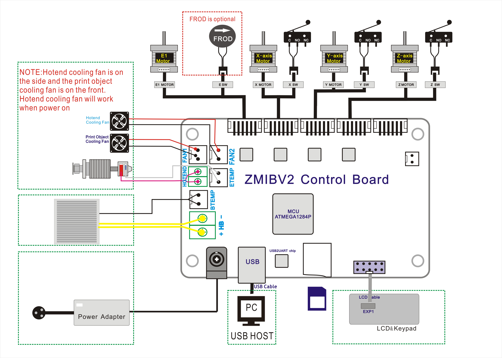

## Hex
Included firmware hex file for Z6F and Z6FB.  

##### What's different between Z6F and Z6FB?  
- **Z6F**   Z6 without heated printing platform  
- **Z6FB**  Z6 with heated printing platform (with heat bed)  

## SourceCode
Included firmware suource code

## USB driver
ZMIB used a CP2102 USB to UART bridge chip, please download the new driver from [***Here***](https://www.silabs.com/products/development-tools/software/usb-to-uart-bridge-vcp-drivers)

## Upload firmware
If you want to upload firmware to your 3D printer, please refer to the guide in [***Here***](https://github.com/ZONESTAR3D/Firmware/tree/master/Firmware_Upload_tool_for_ZRIB_ZMIB)

## Wiring
### Wiring diagram for Z6F

### Wiring diagram for Z6FB

