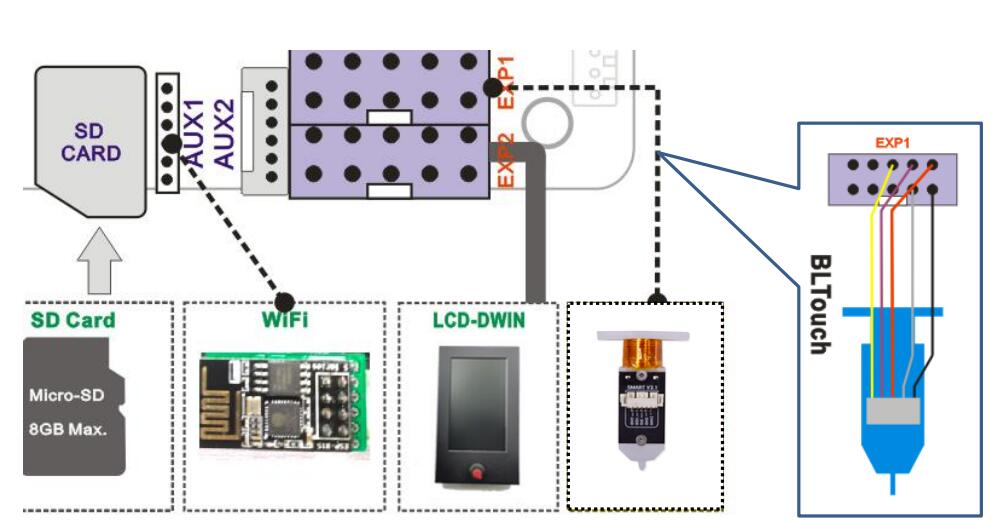

## Release Note
### Z8PM3Pro V1.4.2 [:arrow_down:Download](./Z8PM3Pro_V1_4_2.zip)
- **Date:** 2023-04-26
- [NEW]Add a laser menu, about the detail, please refer to [**here**](https://github.com/ZONESTAR3D/Upgrade-kit-guide/tree/main/Laser_Engraving#two-turn-on-the-laser-engine-feature)
- [CHG]Change the initlize mix rate table (suit for Whit+Cyan+Magenta+Yellow)
- [BUG]Fix a bug, it will cause the printer auto shutdown when doing auto mixing

### Z8PM3Pro V1.4.1 [:arrow_down:Download](./Z8PM3Pro_V1_4_1.zip)
- **Date:** 2022-12-17
- ***First release***

-----
### Wiring

### DWIN LCD Menu Description
About the Description of DWIN LCD Menu, please refer to [**here**](https://github.com/ZONESTAR3D/Upgrade-kit-guide/blob/main/TFT-LCD/LCD-DWIN/user_guide/readme.md).
