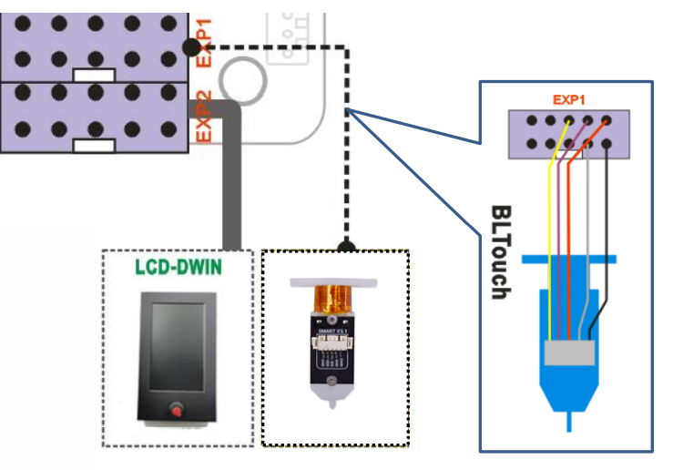

## Firmware for upgraded some optional features
#### Upgraded 3DTouch/BLTouch bed leveling sensor 
**[:arrow_down:Z8PM4MK2_3DTouch_V1_4_3](./Z8PM4MK2_3DTouch_V1_4_3.zip)**
#### Upgraded 3DTouch/BLTouch and TMC2209 motor drivers
**[:arrow_down:Z8PM4MK2_TMC220x_3DTouch_V1_4_3](./Z8PM4MK2_TMC220x_3DTouch_V1_4_3.zip)**
#### Upgraded Dual Gear Extruders (4x right hand)
**[:arrow_down:Z8PM4MK2_BMG_V1_4_3](./Z8PM4MK2_BMG_V1_4_3.zip)**
#### Upgraded 3DTouch/BLTouch and Dual Gear Extruders (4x right hand)
**[:arrow_down:Z8PM4MK2_3DTouch_BMG_V1_4_3](./Z8PM4MK2_3DTouch_BMG_V1_4_3.zip)**
#### Upgraded TMC2209 motor drivers and Dual Gear Extruders (4x right hand)
**[:arrow_down:Z8PM4MK2_TMC220x_BMG_V1_4_3](./Z8PM4MK2_TMC220x_BMG_V1_4_3.zip)**
#### Upgraded TMC2209 motor drivers, 3DTouch and Dual Gear Extruders (4x right hand)
**[:arrow_down:Z8PM4MK2_TMC220x_3DTouch_BMG_V1_4_3](./Z8PM4MK2_TMC220x_3DTouch_BMG_V1_4_3.zip)**

#### Wiring
Connect the 3d touch bed leveling sensor to EXP1  

