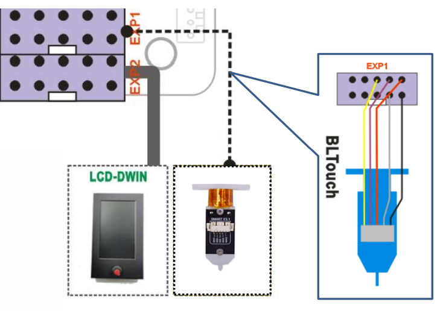

## Firmware for upgraded some optional features
#### Upgraded 3DTouch/BLTouch bed leveling sensor 
**[:arrow_down:Z8PM4MK2A_3DTouch_V1_5_0](./Z8PM4MK2A_3DTouch_V1_5_0.zip)**
#### Upgraded 3DTouch/BLTouch and TMC2209 motor drivers
**[:arrow_down:Z8PM4MK2A_TMC220x_3DTouch_V1_5_0](./Z8PM4MK2_TMC220x_3DTouch_V1_5_0.zip)**

#### Wiring
Connect the 3d touch bed leveling sensor to EXP1  

