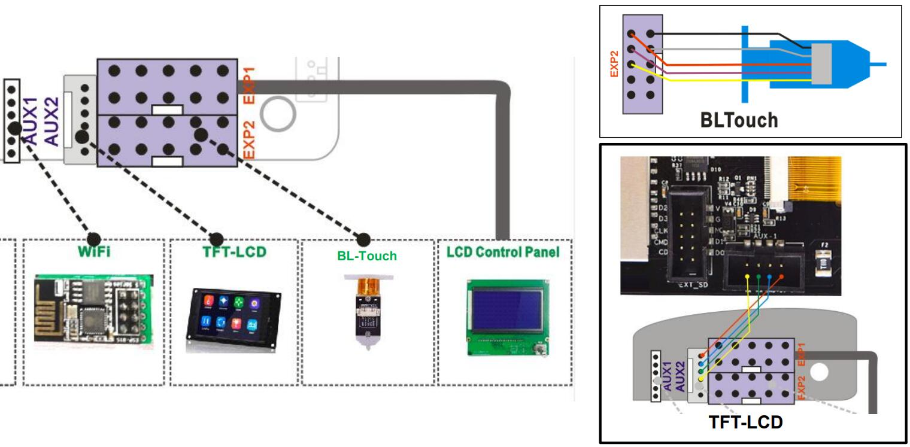

### Z8PM4 Firwmare
- **[:arrow_down:Z8PM4_V1_3_0](./Z8PM4_V1_3_0.zip)** Used A4988 on all motors.
- **[:arrow_down:Z8PM4_TMC220x@XYZ_V1_3_0](./Z8PM4_TMC220x%40XYZ_V1_3_0.zip)** Used TMC220x on XYZ axis motors and A4988 on extruder motors.
- **[:arrow_down:Z8PM4_TMC220x@All_V1_3_0](./Z8PM4_TMC220x%40All_V1_3_0.zip)** Used TMC220x on XYZ axis motors and A4988 on extruder motors.
- **[:arrow_down:Z8PM4_TMC220x@XYZ_3DTouch_V1_3_0](./Z8PM4_TMC220x%40XYZ_3DTouch_V1_3_0.zip)** Used TMC220x on XYZ axis motors and A4988 on extruder motors, upgraded 3DTouch Bed leveling sensor (connect to EXP2).
- **[:arrow_down:Z8PM4_TMC220x@All_3DTouch_V1_3_0](./Z8PM4_TMC220x%40All_3DTouch_V1_3_0.zip)** Used TMC220x on All motors and upgraded 3DTouch Bed leveling sensor (connect to EXP2).

### Wiring

