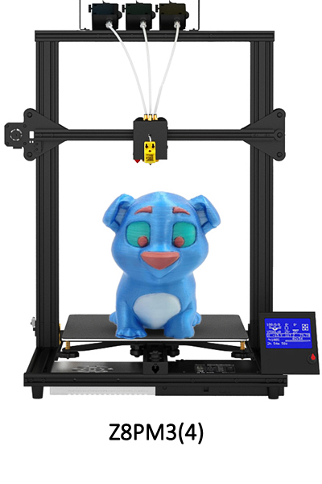
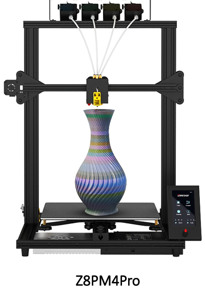

## Firmware of Z8P series 3d printer
### :file_folder: [Z8PM3](./Z8PM3/)
### :file_folder: [Z8PM3Pro](./Z8PM3Pro/)
### :file_folder: [Z8PM4Pro-MK1](./Z8PM4Pro/)
### :file_folder: [Z8PM4Pro-MK2](./Z8PM4-MK2/)

-----
#### What's different between Z8PM4Pro-MK2 and Z8PM4Pro-MK1
- Z8PM4Pro-MK2 upgraded the profiles, the upward and forward sides of the new profile are flat and more beautiful and easier be clean.
- Z8PM4Pro-MK2 used TMC2208 instead of TMC2225 motor driver on control board.    
:warning:To distinguish between MK1 and MK2, you can also watch the **Info>>Model** menu on the LCD screen. MK1 will display "Model: Z8PM4Pro", and MK2 will display "Model: Z8PM4Pro-MK2".

#### What's different between Z8PM3 and Z8PM4Pro
- Z8PM4Pro with 4 extruders and a 4-IN-1-OUT mix color hotend; Z8PM3 with 3 extruders and a 3-IN-1-OUT mix color hotend.
- Z8PM4Pro used a 4.3" TFT-LCD screen but Z8PM3 used a 128x64 dot LCD screen.      

