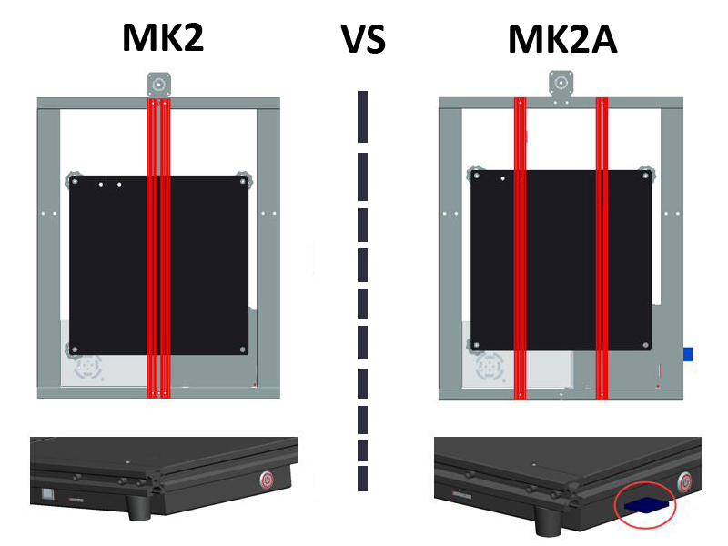

## Firmware for Z8P series 3d printer

-----
#### :file_folder: Z8PM4Pro-MK2A
- **[:arrow_down: Download firmware for Z8PM4Pro-MK2A](./Z8PM4-MK2A/)**
- What's different between Z8PM4Pro-**MK2A** and Z8PM4Pro-**MK2**
  - Z8PM4Pro-MK2A upgraded the Y-axes rail to 2 pieces of 2020 v-slot profiles.
  - Z8PM4Pro-MK2A added a SD card socket on the right of the control box.
  - Z8PM4Pro-MK2A Upgraded the control board from ZM3E4V2.x to ZM3E4V3.x   
  

----
#### :file_folder: Z8PM4Pro-MK2
- **[:arrow_down: Download firmware for Z8PM4Pro-MK2](./Z8PM4-MK2/)**
- What's different between Z8PM4Pro-**MK2** and Z8PM4Pro-**MK1**
  - Z8PM4Pro-MK2 upgraded the hotend to M4V6
  - Z8PM4Pro-MK2 upgraded the profiles, the upward and forward sides of the new profile are flat and more beautiful and easier be clean.
  - Z8PM4Pro-MK2 used TMC2208 instead of TMC2225 motor driver on control board.    
  :warning:To distinguish between MK1 and MK2, you can also watch the **Info>>Model** menu on the LCD screen. MK1 will display "Model: Z8PM4Pro", and MK2 will display "Model: Z8PM4Pro-MK2".
  

----
#### :file_folder: Z8PM4Pro-MK1
- **[:arrow_down: Download firmware for Z8PM4Pro-MK1](./Z8PM4-MK1/)**
#### :file_folder: Z8PM4
- **[:arrow_down: Download firmware for Z8PM4](./Z8PM4/)**
#### :file_folder: Z8PM3Pro
- **[:arrow_down: Download firmware for Z8PM3Pro](./Z8PM3Pro/)**
#### :file_folder: Z8PM3
- **[:arrow_down: Download firmware for Z8PM3](./Z8PM3/)**
- What's different between Z8PM3(4) and Z8PM3(4)**Pro**
  - Z8PM3(4)**Pro** used a 4.3" TFT-LCD screen but Z8PM3(4) used a 128x64 dot LCD screen.      
   
- What's different between Z8P**M3** and Z8**PM4**
  - **Z8PM4** equipped with 4 extruders and a 4-IN-1-OUT mix color hotend.    
  - **Z8PM3** equipped with 3 extruders and a 3-IN-1-OUT mix color hotend.     

