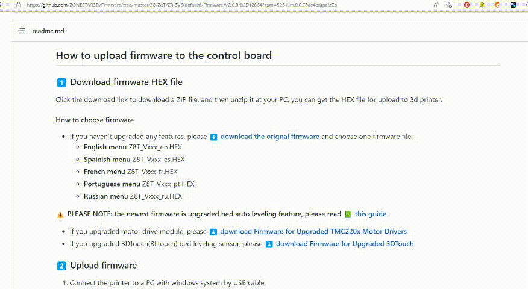

## How to upload firmware to the control board
### :one: Download firmware HEX file
Click the download link to download a ZIP file, and then unzip it at your PC, you can get the HEX file for upload to 3d printer.

#### How to choose firmware
- If you haven't upgraded any features, please [**:arrow_down: download the orignal firmware**](./Z8T_V200.zip) and choose one firmware file:
  - **English menu** Z8T\_Vxxx_en.HEX    
  - **Spainish menu** Z8T\_Vxxx_es.HEX   
  - **French menu** Z8T\_Vxxx_fr.HEX   
  - **Portuguese menu** Z8T\_Vxxx_pt.HEX   
  - **Russian menu** Z8T\_Vxxx_ru.HEX     

:warning: **PLEASE NOTE: the newest firmware is upgraded bed auto leveling feature, please read [:green_book: this guide](./Bed%20auto%20leveling/Bed%20auto%20leveling%20user%20guide.pdf)**.
- If you upgraded motor drive module, please [**:arrow_down: download Firmware for Upgraded TMC220x Motor Drivers**](./TMC220x.zip)   
- If you upgraded 3DTouch(BLtouch) bed leveling sensor, please [**:arrow_down: download Firmware for Upgraded 3DTouch**](./3DTouch.zip)     

### :two: Upload firmware
1. Connect the printer to a PC with windows system by USB cable.
2. Open **"device manager"** on your PC, find the **"Port (COM and LPT)"** item, to check see if you can find a  **"USB virtual serial port CP2102"** or **"USB to UART bridge CP2102"**. if not, please click [**here**](https://www.silabs.com/developers/usb-to-uart-bridge-vcp-drivers?tab=downloads) to download the driver and install to your PC.  
      :memo: **Didn't find the "Port (COM and LPT)" item? please refer to [here](https://profound-answers.com/what-are-com-and-lpt-ports/#:~:text=How%20do%20I%20find%20ports%20COM%20and%20LPT%3F,item%20will%20now%20display%20in%20Devices%20and%20Printers.).**  

3. Refer to [**here**](https://github.com/ZONESTAR3D/Firmware/tree/master/Firmware_Upload_tool_for_ZRIB_ZMIB) to download firmware upload tool and refer to the guide to upload firmware to the control board.

-------
### NOTE: Should you have any question on upgrading firmware, please feel free to contact our support team by email [**support@zonestar3d.com**](support@zonestar3d.com)

