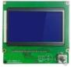
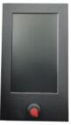

## LCD12864
### Firmware hex file for LCD12864 screen
[***More about 128x64 dots LCD screen***](https://www.aliexpress.com/item/4001317124258.html)  
  

## LCDDWIN  
### Firmware hex file for 4.3" TFT-LCD screen
[***Documents of 4.3" TFT-LCD screen***](https://github.com/ZONESTAR3D/Upgrade-kit-guide/tree/main/TFT-LCD/LCD-DWIN)  
  
### [Upgrade Now](https://www.aliexpress.com/item/1005002378065646.html)  

## TFTLCD35
### Firmware hex file for 3.5" TFT-LCD screen
[***Documents of 3.5" TFT-LCD screen***](https://github.com/ZONESTAR3D/Upgrade-kit-guide/tree/main/TFT-LCD/TFTLCD35-MK)  

### [Upgrade Now](https://www.aliexpress.com/item/1005001314076252.html)  

 