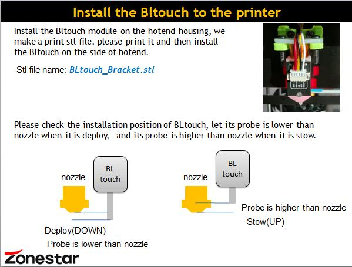
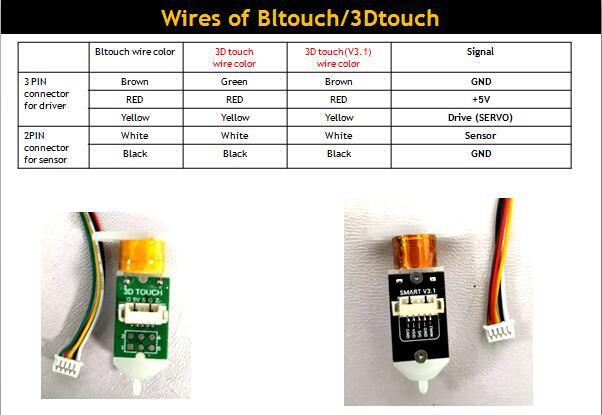
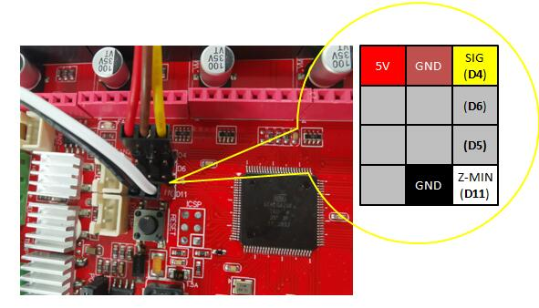
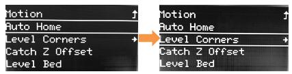
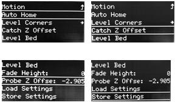
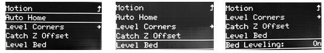
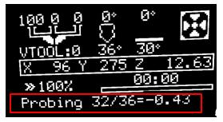
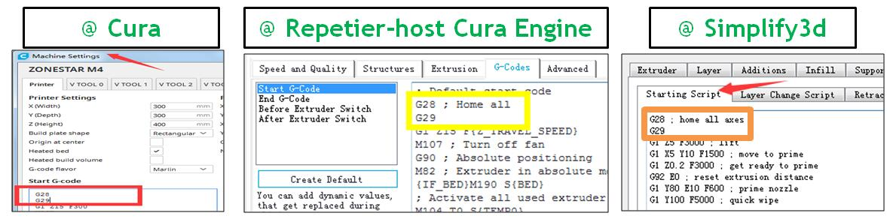

# How to upgrade 3DTouch (for ZRIB control board)
## Step 1: Installation
  
[**Bracket download link**](https://github.com/ZONESTAR3D/Upgrade-kit-guide/tree/main/Bed%20Leveling%20Sensor/BLtouch(3D%20Touch))
## Step 2: Upload firmware (for ZRIB control board)
1. Unzip the firmware upgrade tool “Firmware Upload tools.zip” to your computer.  
2. Copy the firmware “HEX “to the extracted directory.  
3. Connect the printer to your PC, making sure the driver is properly installed.  
4. Refer to the “AVRUpdateTools userGuide_ZRIB.pdf” instructions in the upgrade tool to upload the firmware to the control board.  
[Upload tool download link](https://github.com/ZONESTAR3D/Firmware-Upload-tool)
## Step 3: Wiring

## Step 4: Verify installation and wiring
1. Power on the printer, and watch the LED on the Bltouch, LED will light if wires is connected well and Power on.     2. Red LED will light if the probe is triggered.    
3. Operate the control panel, **Configuration>>Bltouch>>Reset**.  
4. Operate the control panel, ***Configuration >>Bltouch>>Self-test**, Bltouch will deploy and stow automatically, you can check if the installation height of BLtouch is OK by using this function.  
5. Operate the control panel, **Configuration >>Bltouch>>Reset**. 
6. Operate the control panel, **Configuration >>Bltouch>>Deploy***, the probe will up;  
7. Operate the control panel, **Configuration >>Bltouch>>Stow**, the probe will down;  
## Step 5: Level Corners
1. Make sure the hotbed and nozzle are cool, clean the filament on the nozzle.  
2. Clean the hotbed.  
3. Turn on the 3d printer.  
4. Do **Montion>> Bed Leveling>>Auto HOME**. Then do **Montion>> Bed Leveling>>Level Corners**.

## Step 6: Catch Z offset
1. Do **Montion>> Bed Leveling>> Auto HOME.**  
2. Do **Montion>> Bed Leveling>> Catch Z Offset.**  
3. Wait for finished of the test, and see the Z offset value on menu **Montion>> Bed Leveling>> Probe Z Offset.**
4. Do **Montion>> Bed Leveling>> Store Settings**. to save the Z offset value.  
   
## Step 7: Auto Leveling 
### 1. Leveling measure
1. Do **Montion>> Bed Leveling>> Auto HOME**.
2. Do **Montion>> Bed Leveling>> Level Bed**, wait for  finished of the test, 
3. Operate Auto Home again, the auto leveling will change from off to on. It indicates that the automatic leveling feature is actived.
   
### 2.Check the measuing data
When probing, the measured data will show on the bottom of screen, please check the data.  
**NOTE:**   
1. The measurement result should be between -1.0 to 1.0 mm. If it exceeds, it is recommended that you try to fine tune the printer or improve the flatness of the hotbed, because it may affect the printing quality.  
2. If you found that there is a large deviation in data arrangement between the Left/Right sides or the Front/Back sides, please adjust the bottom screw of the hotbed (when the data is + turn down the hotbed, when the data is - turn up the hotbed).  
   
## Step 8: Apply auto leveling feature
Auto leveling feature will be disable automatically when the printer reset, you can turn it on manually or 
let it do automatically every time when printing from SD card.
### Appling auto leveling by manually:
1. **Motion>> Bed Leveling>> Level Bed >>Auto Home**.
2. **Motion>> Bed Leveling>> Level Bed >>bed leveling:** *OFF* **Change to** *ON*  
### Leveling  the hotbed at each printing from SD card:
Add a G29 command (following G28) to the start gcode of slicing software, so it will do bed auto leveling before printing.    
  

