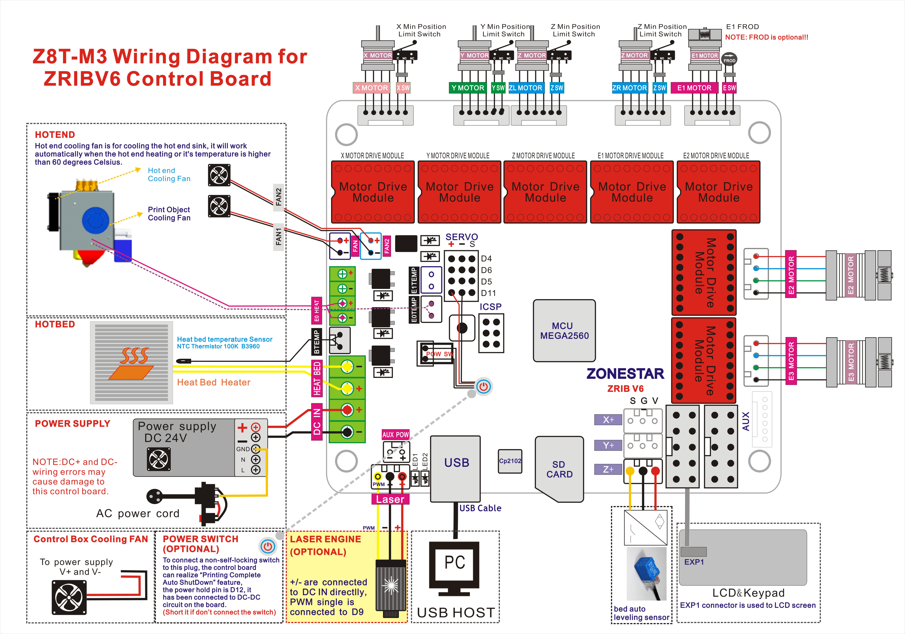

### Firmware
Included firmware hex files

### Source Code
Please download the fimrware source code from [**Here**](
https://github.com/ZONESTAR3D/source-code-for-3d-printer)

### Wiring

### How to upload firmware to ZRIBV6 control board
- **Windows**: 
Please refer to [**here**](https://github.com/ZONESTAR3D/Firmware/tree/master/Firmware_Upload_tool_for_ZRIB_ZMIB).  
- **Macos or Linux** Please upload firmware by cura, refer to this [**video toturial**](https://www.youtube.com/watch?v=I7Kn7YI0fIo)  

