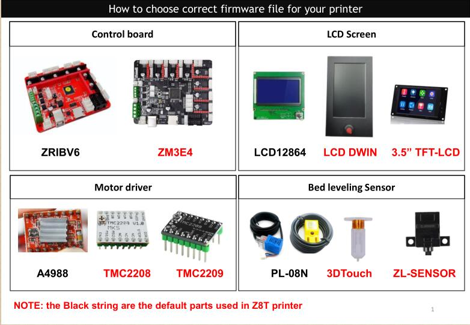
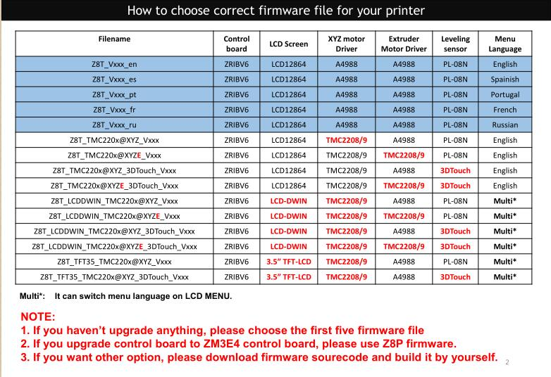
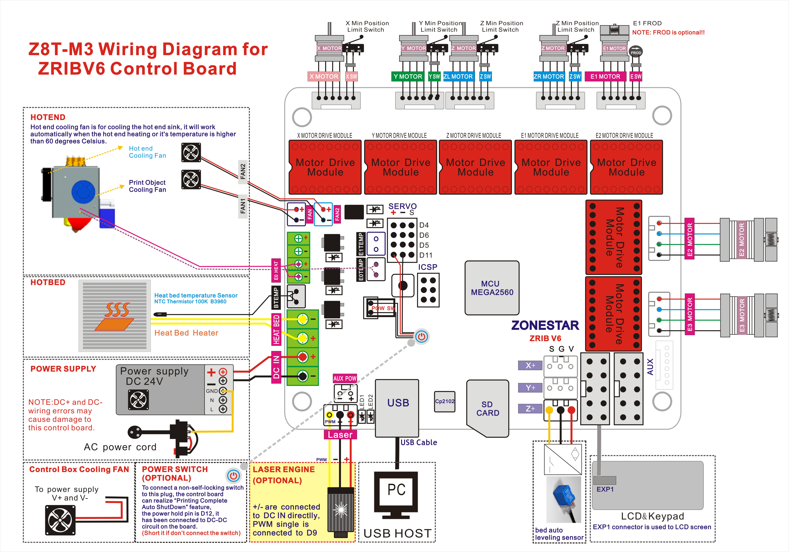

### How to choose correct firmware for your Z8T 3D printer
- If you haven't upgrade any features, please choose the [***default firmware***](https://github.com/ZONESTAR3D/Firmware/tree/master/Z8/Z8T/ZRIBV6(default)/Firmware/V2.0.0/LCD12864)  
- If you upgraded some features, please choose the firmware according to the below guide. 
- If you upgraded the control board to 32-bits control board ZM3E4, please choose the firmware in the directory "ZM3E4". **NOTE: when you intstall ZM3E4 control board, you need to move the power supply a little left, and take care to aovide the motor drivers touched the Y profile**        

### Wiring Diagram
#### ZRIBV6

#### ZM3E4
_ZM3E4_Wiring_Diagram.jpg)

