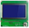
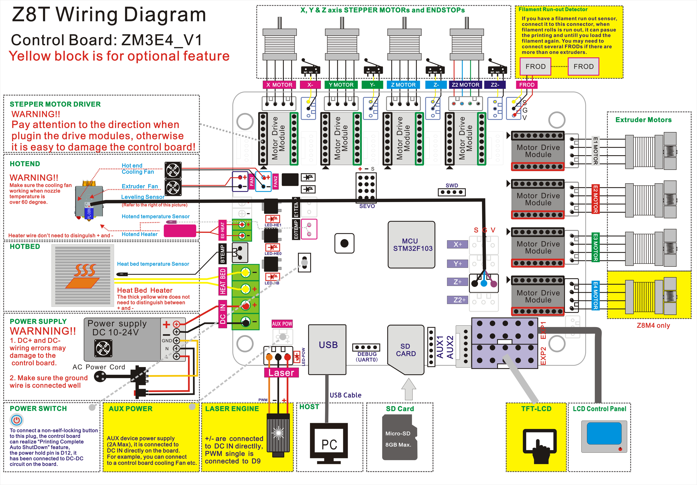
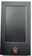

#### Firmware Upload Steps:
1. Download the zip file and unzip it
2. Copy firmware.bin to the root directory of Micro-SD card
3. Power off the printer and plug the Micro-SD card into socket on control board
4. Power on the printer, push the power button and wait about 30 seconds
5. Do the below step on LCD screen to initialize EEPROM after upload firmware:
LCD12864: MENU>>config>>Advanced setting>>Initlizate EEPROM
DWIN TFT_LCD: MENU>>config>>Restore Defaults

-----
###  Firmware for ZONESTAR 128x64 LCD screen
- **[:arrow_down: Z8XM2_ZM3E4_LCD12864](./LCD12864/Z8XM2_ZM3E4_LCD12864.zip): A4988 motor driver used on all axis.**
- **[:arrow_down: Z8XM2_ZM3E4_LCD12864_TMC220x@XYZ](./LCD12864/Z8XM2_ZM3E4_LCD12864_TMC220x@XYZ.zip): TMC2208(TMC2209) motor driver used on X/Y/Z axis and A4988 motor driver used on Extruder.**
- **[:arrow_down: Z8XM2_ZM3E4_LCD12864_TMC220x@ALL](./LCD12864/Z8XM2_ZM3E4_LCD12864_TMC220x@ALL.zip): TMC2208(TMC2209) motor driver used on all axis.**
#### Wiring Diagram

-----
###  Firmware for Reprap 128x64 LCD screen
- **[:arrow_down: Z8XM2_ZM3E4_ReprapLCD12864](./LCD12864/Z8XM2_ZM3E4_ReprapLCD12864.zip): A4988 motor driver used on all axis.**
- **[:arrow_down: Z8XM2_ZM3E4_ReprapLCD12864_TMC220x@XYZ](./LCD12864/Z8XM2_ZM3E4_ReprapLCD12864_TMC220x@XYZ.zip): TMC2208(TMC2209) motor driver used on all axis and A4988 motor driver used on Extruder.**
- **[:arrow_down: Z8XM2_ZM3E4_ReprapLCD12864_TMC220x@ALL](./LCD12864/Z8XM2_ZM3E4_ReprapLCD12864_TMC220x@ALL.zip): TMC2208(TMC2209) motor driver used on all axis.**
#### Wiring Diagram

-----
###  Firmware for DWIN 4.3" TFT-LCD screen
