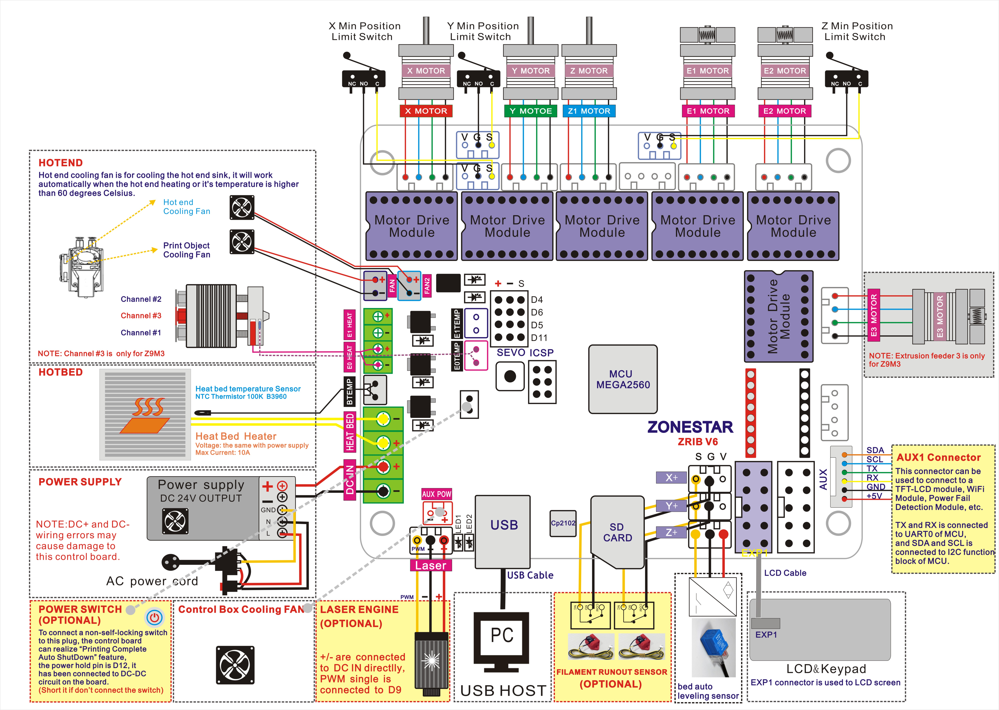
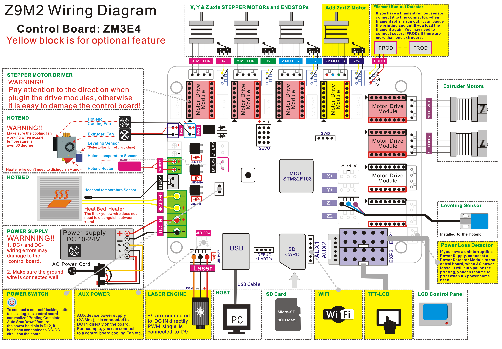

## Firmware for ZONESTAR Z9M2  
### Default configurations for Z9M2:
- Control board: **ZRIBV6 control board**
- Extruder: 2x [Extrusion feeder](https://www.aliexpress.com/item/1005001463791538.html) with [2-IN-1-OUT hotend](https://www.aliexpress.com/item/1005001275124087.html)
- Motor drivers: [A4988](https://www.aliexpress.com/item/2255800771058461.html)   
- LCD Screen: [128x64 dots LCD screen](https://www.aliexpress.com/item/2255801130809506.html)
#### :arrow_down: [Firmware HEX file for default ZRIBV6 control board](https://github.com/ZONESTAR3D/Firmware/blob/master/backup/Firmware/Z9.zip)
#### :arrow_down: [Firmware Source code for default ZRIBV6 control board](https://github.com/ZONESTAR3D/Firmware/blob/master/backup/Sourcecode/V4.zip)
#### Wiring Diagram for ZRINB6

### Upload the firmware to ZRIB control board
#### Upload firmware with Arduloader (only worked on windows)
- About how to upload firmware to ZRIB control board with Arduloader, please refer to [**here**](https://github.com/ZONESTAR3D/Firmware/tree/master/Firmware_Upload_tool_for_ZRIB_ZMIB).
#### Upload firmware by Cura
1. Download the .hex file and upzip to your PC
2. Connect the printer to your computer via the USB cable.
3. Open up Cura. Click "Machine" on the menu bar and click "Install custom firmwa..."
4. Navigate to the .hex file and open it.
5. Click "OK" if a notification pops up regarding updating RepRap with Cura.
6. Once it says the firmware has been updated successfully, you can see the LCD screen restart again and show the first menu. 

-------
## Upgraded ZM3E4 32-bit control board
#### :file_folder: [Firmware BIN file](./Firmware/)
#### :link: [Firmware Source code](https://github.com/ZONESTAR3D/source-code-for-3d-printer)
#### Wiring Diagram for ZM3E4
