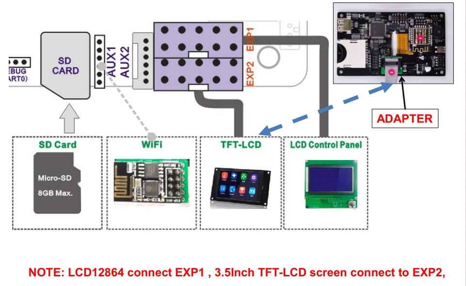
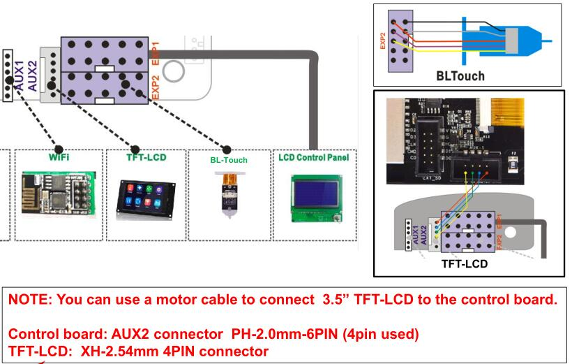

## Firmware
#### [:arrow_down: Z9M3_ZM3E4_V6_0_0_en: ](./Z9M3_ZM3E4_V6_0_0_en.zip) 
Z9M3 Upgrade to ZM3E4 control board, LCD128x64 LCD screen (english Menu) or TFT-3.5" LCD screen.
#### [:arrow_down: Z9M3_ZM3E4_V6_0_0_ru: ](./Z9M3_ZM3E4_V6_0_0_ru.zip) 
Z9M3 Upgrade to ZM3E4 control board, LCD128x64 LCD screen (Russian Menu) or TFT-3.5" LCD scree.
#### [:arrow_down: Z9M3_ZM3E4_TITAN_V6_0_0_en: ](./Z9M3_ZM3E4_TITAN_V6_0_0_en.zip) 
Z9M3 Upgrade to ZM3E4 control board and Used Titan Extruders, LCD128x64 LCD screen (Russian Menu) or TFT-3.5" LCD screen.
#### [:arrow_down: Z9M3_ZM3E4_TITAN_TMC220x@XYZ_V6_0_0_en: ](./Z9M3_ZM3E4_TITAN_TMC220x@XYZ_V6_0_0_en.zip) 
Z9M3 Upgrade to ZM3E4 control board,  Used Titan Extruders, Used TMC2208(9) Motor Drivers on XYZ axis, LCD128x64 LCD screen (Russian Menu) or TFT-3.5" LCD screen.
#### [:arrow_down: Z9M3_ZM3E4_TITAN_TMC220x@ALL_V6_0_0_en: ](./Z9M3_ZM3E4_TITAN_TMC220x@ALL_V6_0_0_en.zip) 
Z9M3 Upgrade to ZM3E4 control board,  Used Titan Extruders, Used TMC2208(9) Motor Drivers on all axis, LCD128x64 LCD screen (Russian Menu) or TFT-3.5" LCD screen.
#### [:arrow_down: Z9M3_ZM3E4_TITAN_TMC220x@XYZ_3DTouch_V6_0_0_en: ](./Z9M3_ZM3E4_TITAN_TMC220x@XYZ_3DTouch_V6_0_0_en.zip) 
Z9M3 Upgrade to ZM3E4 control board, Used Titan Extruders, Used TMC2208(9) Motor Drivers on XYZ axis, Used BLTouch/3DTouch Bed leveling Sensor, LCD128x64 LCD screen (Russian Menu) or TFT-3.5" LCD screen.
#### [:arrow_down: Z9M3_ZM3E4_TITAN_TMC220x@ALL_3DTouch_V600: ](./Z9M3_ZM3E4_TITAN_TMC220x@ALL_3DTouch_V600.zip) 
Z9M3 Upgrade to ZM3E4 control board, Used Titan Extruders, Used TMC2208(9) Motor Drivers on all axis, Used BLTouch/3DTouch Bed leveling Sensor, LCD128x64 LCD screen (Russian Menu) or TFT-3.5" LCD screen.

-----
### Wiring LCD12864 + 3.5" TFT-LCD
 

### Wiring LCD12864 + 3.5" TFT-LCD + 3DTouch
 

 