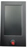

##  :file_folder: [For 128x64 dot LCD screen](./LCD12864/)
##  :file_folder: [For DWIN TFT-LCD screen](./LCD_DWIN/)
## :file_folder: [Customized firmware](./Customize/)
- Upgrade TMC2208(9) Motor Drivers to all step motors, and exchanged X motor and Z2 motors connector.     
  **[:arrow_down:Z9M3_ZM3E4_TITAN_TMC220x%40ALL_EXCHANGEX%26Z2_V6_0_0_en](./Customize/Z9M3_ZM3E4_TITAN_TMC220x%40ALL_EXCHANGEX%26Z2_V6_0_0_en.zip)**
- Upgrade TMC2208(9) Motor Drivers to all step motors, and used independent stpes/mm for each extruder.     
**[:arrow_down:Z9M3_ZM3E4_TITAN_TMC220x%40ALL_Independent_ESTEPS_V6_2_3_en](./Customize/Z9M3_ZM3E4_TITAN_TMC220x%40ALL_Independent_ESTEPS_V6_2_3_en.zip)**
- Upgrade TMC2208(9) Motor Drivers to all step motors, and 3dtouch bed leveling sensor, fan speed is start from 128.     
**[:arrow_down:Z9M3_ZM3E4_TMC220x%40ALL_3DTouch_FAN128](./Customize/Z9M3_ZM3E4_TMC220x%40ALL_3DTouch_FAN128.zip)**
