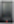

## :file_folder: [For 128x64 dot LCD screen](./LCD12864/)

## :file_folder: [For DWIN TFT-LCD screen](./LCD_DWIN/)

## :file_folder: [Specially customized firmware](./Customize/)
- [Upgrade TMC2208(9) Motor Drivers to all step motors, and exchanged X motor and Z2 motors connector](./Customize/Z9M3_ZM3E4_TITAN_TMC220x%40ALL_EXCHANGEX%26Z2_V6_0_0_en.zip)
- [Upgrade TMC2208(9) Motor Drivers to all step motors, and 3dtouch bed leveling sensor, fan speed is start from 128](./Customize/Z9M3_ZM3E4_TMC220x%40ALL_3DTouch_FAN128.zip)