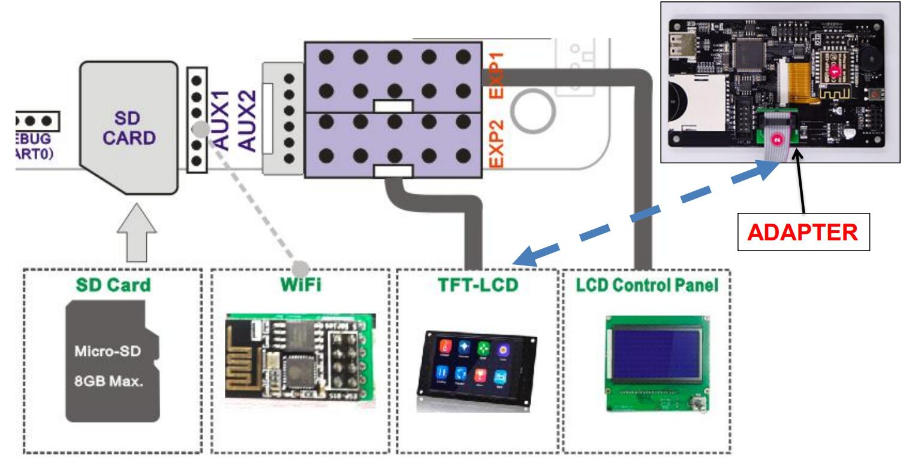
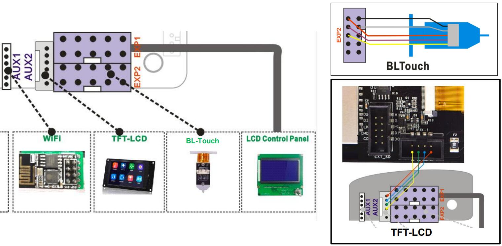

## Release Note
### Firmware V3.5.1
**Date:** 	 2023-08-23
**NOTE:**    
[**CHG**] Correct shows temperature of hotend and hotbed.   
[**CHG**] Change the maximus work temperature of hotend to 300 degreeC.    
[**BUG**] Fixed known bugs on power loss recovery feature.  
- **[:arrow_down: Z9M4 + LCD12864 (Z9M4 default)](./Z9M4_V3_5_1.zip) [:art: Wiring Diagram: Wiring 1](#wiring-1)**
- **[:arrow_down: Upgraded TMC2209 motor drivers @ XYZ axis](./Z9M4_TMC220x%40XYZ_V3_5_1.zip) [:art: Wiring Diagram: Wiring 1](#wiring-1)**
- **[:arrow_down: Upgraded TMC2209 motor drivers @ all axis](./Z9M4_TMC220x%40All_V3_5_1.zip) [:art: Wiring Diagram: Wiring 1](#wiring-1)**
- **[:arrow_down: Upgraded TMC2209 motor drivers @ all axis and BGM Extruders](./Z9M4_TMC220x@All_BGM_V3_5_1.zip) [:art: Wiring Diagram: Wiring 1](#wiring-1)**
- **[:arrow_down: Upgraded TMC2209 motor drivers @ all axis and 3Dtouch bed leveling sensor](./Z9M4_TMC220x@All_3DTouch_V3_5_1.zip) [:art: Wiring Diagram: Wiring 2](#wiring-2)**
- **[:arrow_down: Upgraded TMC2209 motor drivers @ all axis and 3Dtouch bed leveling sensor and BGM Extruders](./Z9M4_TMC220x@All_3DTouch_BGM_V3_5_1.zip) [:art: Wiring Diagram: Wiring 2](#wiring-2)**

### Firmware V3.2.2
**Date:** 	 2022-11-24
**NOTE:**    
[**CHG**] Correct shows temperature of hotend and hotbed.   
[**BUG**] Fixed the system crashes on gradient and random mixing color printing.  
[**BUG**] Fixed temperature instability issue on over 230 degreeC.  
[**BUG**] Fixed some bugs.  
- **[:arrow_down: Z9M4 + LCD12864 (Z9M4 default)](./Z9M4_V3_2_3.zip) [:art: Wiring Diagram: Wiring 1](#wiring-1)**
- **[:arrow_down: Upgraded TMC2209 motor drivers @ XYZ axis](./Z9M4_TMC220x%40XYZ_V3_2_3.zip) [:art: Wiring Diagram: Wiring 1](#wiring-1)**
- **[:arrow_down: Upgraded TMC2209 motor drivers @ all axis](./Z9M4_TMC220x%40All_V3_2_3.zip) [:art: Wiring Diagram: Wiring 1](#wiring-1)**
- **[:arrow_down: Upgraded TMC2209 motor drivers @ all axis and BGM Extruders](./Z9M4_TMC220x%40All_BGM_V3_2_3.zip) [:art: Wiring Diagram: Wiring 1](#wiring-1)**
- **[:arrow_down: Upgraded TMC2209 motor drivers @ all axis and 3Dtouch bed leveling sensor](./Z9M4_TMC220x%40All_3DTouch_V3_2_3.zip) [:art: Wiring Diagram: Wiring 2](#wiring-2)**

### Wiring 1
- **LCD12864 (+ 3.5" TFT-LCD Screen + WiFi Module)**     
**:warning: 3.5" TFT-LCD Screen and WiFi Module is optional**    

### Wiring 2:
- **LCD12864 + 3DTouch (+ 3.5" TFT-LCD Screen + WiFi Module)**     
**:warning: 3.5" TFT-LCD Screen and WiFi Module is optional**    
