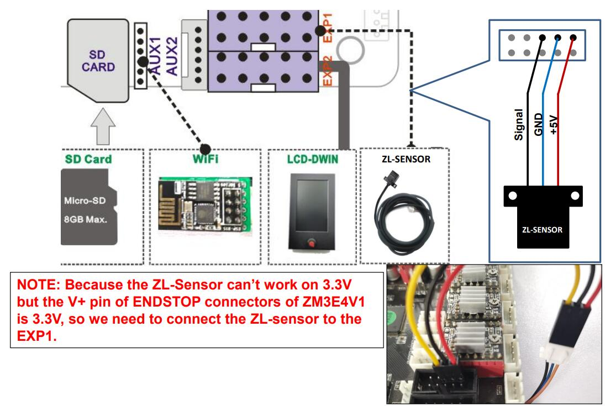
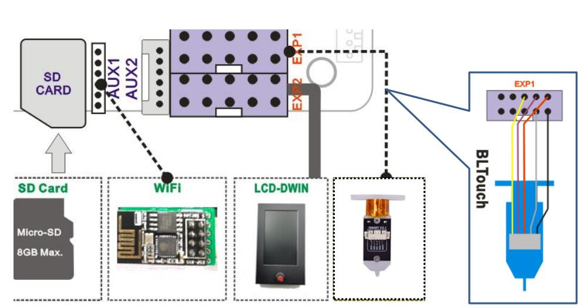

## Release Note
### Firmware V3.2.2
**Date:** 	 2022-11-24
**NOTE:**    
You must upgrade the DWIN LCD screen firmware before upgrading the printer firmware to 3.0.0 or last version, otherwise it will cause some display issue on LCD MENU. For more details, please refer to :point_right: [**here**](https://github.com/ZONESTAR3D/Upgrade-kit-guide/tree/main/TFT-LCD/LCD-DWIN)
[**NEW**] Add a "Auto Unload" menu, turn on it, the printer will unload filament automatically if the printing is abort.    
  --**This feature only work on E4 (4-IN-1-OUT Non-Mix Color) Hotend**.   
[**NEW**] Display the print elapsed time xxxHxxM after printing finished.  
[**CHG**] Don't turn off power if the hotend/hotbed can't heat to the setting temperature.   
[**CHG**] Correct shows temperature of hotend and hotbed.   
[**CHG**] Set the home-offset default value to 0.   
[**CHG**] Modify print remain time on LCD screen.   
[**CHG**] Change "PID auto tune" feature.  
[**BUG**] Fixed the system crashes on gradient and random mixing color printing.  
[**BUG**] Fixed temperature instability issue on over 230 degreeC.  
[**BUG**] Fixed some bugs.  
- **[:arrow_down: Z9M4 + LCDDWIN](./Z9M4_LCDDWIN_V3_2_2.zip) [:art: Wiring Diagram: Wiring 1](#wiring-1)**
- **[:arrow_down: Z9M4 + LCDDWIN + TMC220x@XYZ ](./Z9M4_LCDDWIN_TMC220x%40XYZ_V3_2_2.zip) [:art: Wiring Diagram: Wiring 1](#wiring-1)**
- **[:arrow_down: Z9M4 + LCDDWIN + TMC220x@All ](./Z9M4_LCDDWIN_TMC220x%40All_V3_2_2.zip) [:art: Wiring Diagram: Wiring 1](#wiring-1)**
- **[:arrow_down: Z9M4 + LCDDWIN + TMC220x@All + BGM Extruder](./Z9M4_LCDDWIN_BGM_TMC220x%40All_V3_2_2.zip) [:art: Wiring Diagram: Wiring 1](#wiring-1)**
- **[:arrow_down: Z9M4 + LCDDWIN + TMC220x@All + 3DTouch](./Z9M4_LCDDWIN_3DTouch_TMC220x%40All_V3_2_2.zip) [:art: Wiring Diagram: Wiring 2](#wiring-1)**

### Wiring 1
- **4.3" TFT_LCD (+ WiFi Module)**     
**:warning: WiFi Module is optional**    

### Wiring 2:
- **4.3" TFT_LCD + 3DTouch (+ WiFi Module)**     
**:warning: WiFi Module is optional**    

