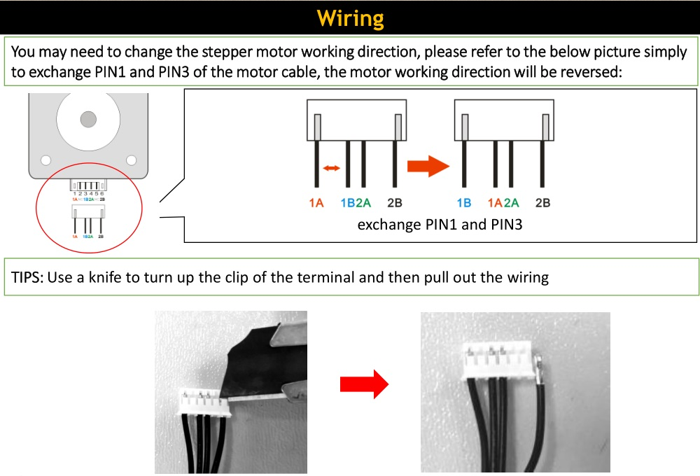

## :book: Firmware Upload Steps:
1. Download the zip file and unzip it
2. Copy firmware.bin to the root directory of Micro-SD card, 
NOTE: !!if there is a "old_fw.bin" in the SD card, delete it first!!
3. Power off the printer and plug the Micro-SD card into socket on control board
4. Power on the printer, push the power button and wait about 30 seconds
5. Do the below step on LCD screen to initialize EEPROM after upload firmware:
- **for LCD12864** ***MENU>>Configuration>>Advanced setting>>initialize  EEPROM***
- **for LCD_DWIN** ***MENU>>Control>>Restore Default***

----
### :file_folder: [Firmware for LCD12864 and 3.5" TFT_LCD Screen](./LCD12864/)
### :file_folder: [Firmware for 4.3" TFT_LCD Screen](./LCD_DWIN/)

----
### :file_folder: [Firmware Backup](./backup/)

----
## Wiring
About wiring, please refer to "[Z9M4 Firmware and Wiring Diagram.pdf](.\./Z9M4%20Firmware%20and%20Wiring%20Diagram.pdf)"
### Motor Working Direction
**If the motor working direction is reserved, please refer to the below photo to modify it:**

