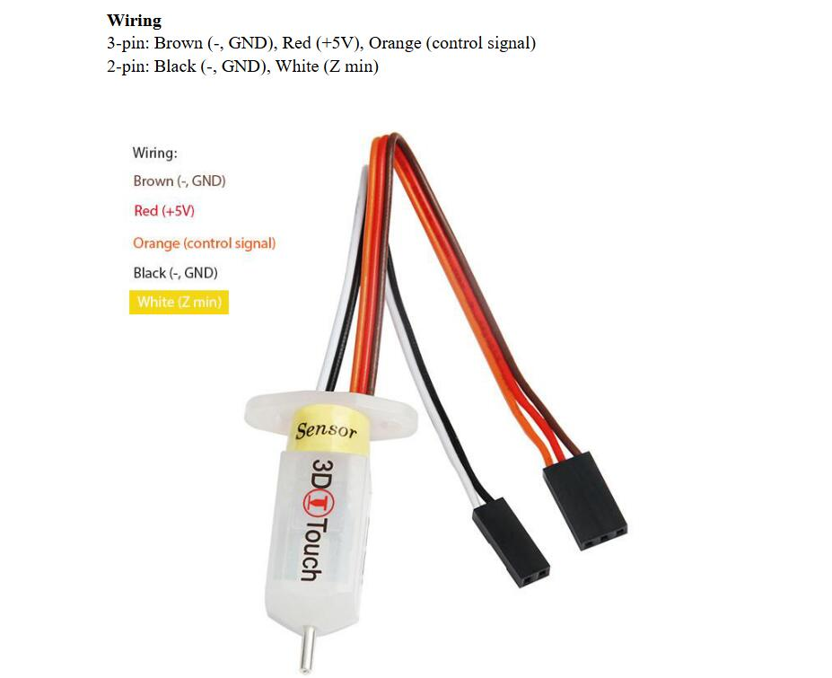

### :warning: !ATTETION PLEASE! 
- You must upgrade the DWIN LCD screen firmware before upgrading the printer firmware to 2.4.0 or last version, otherwise it will cause some display issue on LCD MENU. For more details, please refer to :point_right: [**here**](https://github.com/ZONESTAR3D/Upgrade-kit-guide/tree/main/TFT-LCD/LCD-DWIN)
- The customized firmware may not be test completely, if there is any question, please feel free to let me know, thanks! email: support@zonestar3d.com

-----
### Release Note
If you want to konw more about what's different on the different firmware version, please read the [:book:Release Note](https://github.com/ZONESTAR3D/Firmware/tree/master/Z9/Z9V5/bin/Z9V5Pro-MK3/beta).

### Upgraded all motor drivers to TMC2209
- **[:arrow_down:Z9V5Pro-MK3-TMC2209_V3_4_0](./Z9V5Pro-MK3-TMC2209_V3_4_0.zip)**
- **[:arrow_down:Z9V5Pro-MK3-TMC2209_V3_3_2](./Z9V5Pro-MK3-TMC2209_V3_3_2.zip)**
- **[:arrow_down:Z9V5Pro-MK3-TMC2209_V3_3_0](./Z9V5Pro-MK3-TMC2209_V3_3_0.zip)**
- **[:arrow_down:Z9V5Pro-MK3-TMC2209_V3_1_1](./Z9V5Pro-MK3-TMC2209_V3_1_1.zip)**
### Upgraded bed leveling sensor to 3DTouch/BLTouch
- **[:arrow_down:Z9V5Pro-MK3-3DTouch_V3_3_0](./Z9V5Pro-MK3-3DTouch_V3_3_0.zip)**
### Upgraded all motor drivers to TMC2209 and Upgraded bed leveling sensor to 3DTouch/BLTouch.
- **[:arrow_down:Z9V5Pro-MK3-3DTouch-TMC2209_V3_3_0](./Z9V5Pro-MK3-3DTouch-TMC2209_V3_1_1.zip)**
- **[:arrow_down:Z9V5Pro-MK3-3DTouch-TMC2209_V3_1_1](./Z9V5Pro-MK3-3DTouch-TMC2209_V3_1_1.zip)**

### Upgraded Extruders to Dual Gear Extruders 
- **[:arrow_down:Z9V5Pro-MK3-BGM_V3_3_0](./Z9V5Pro-MK3-BGM_V3_3_0.zip)**
- **[:arrow_down:Z9V5Pro-MK3-BGM_V3_1_1](./Z9V5Pro-MK3-BGM_V3_1_1.zip)**

### Upgrade to 500mmx500mm build size 
:warning:NOTE: Please refer to the firmware for Z9V5Pro-MK4, and change the hotend type to "mixing color" on the "Control>>Configre>>Hotend Type:" menu.    
:link:**Firmware Download Link:https://github.com/ZONESTAR3D/Firmware/tree/master/Z9/Z9V5/bin/Z9V5Pro-MK4/customized** 

-----
### Wiring
Connect the 3d touch bed leveling sensor to EXP1  
   
   

-----
#### Firmware Upload Steps 
1. Download the zip file and unzip it.
2. Copy firmware.bin to the root directory of micro-SD card, 
NOTE: !!if there is a "old_fw.bin" in the SD card, delete it first!!
3. Power off the printer and plug the micro-SD card into socket on control board
4. Power on the printer, push and hold the DC power button 3 seconds, the ZONESTAR Logo backlight will flash, wait until it goes out.
5. Push and hold the DC power button 3 seconds , until the LCD screen shows ZONESTAR LOGO.
6. Do the below step on LCD screen to initialize EEPROM: ***MENU>>Control>>Restore Defaults***