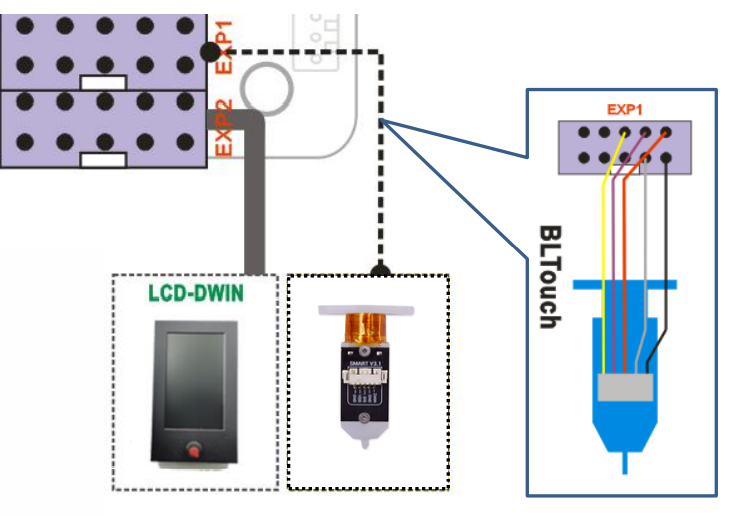

### About how to upload firmware of the 3d printer, please refer to [:point_right: here](https://github.com/ZONESTAR3D/Firmware/tree/master/Z9/Z9V5/bin#how-to-upload-firmware-to-z9v5pro)

### :warning: !ATTENTION PLEASE!
- The customized firmware may not be test completely, if there is any question, please feel free to let me know, thanks! email: support@zonestar3d.com

-----
### Upgraded bed leveling sensor to 3DTouch/BLTouch.
**[:arrow_down:Z9V5ProMK4_3DTouch_V1_2_3](./Z9V5ProMK4_3DTouch_V1_2_3.zip)**
### Upgraded all motor drivers to TMC2209
**[:arrow_down:Z9V5ProMK4_TMC220x@All_V1_2_3](./Z9V5ProMK4_TMC220x@All_V1_2_3.zip)**
### Upgraded all motor drivers to TMC2209 and Upgraded bed leveling sensor to 3DTouch/BLTouch.
**[:arrow_down:Z9V5ProMK4_TMC220x@All_3DTouch_V1_2_3 ](./Z9V5ProMK4_TMC220x@All_3DTouch_V1_2_3.zip)**

-----
### Wiring
Connect the 3d touch bed leveling sensor to EXP1  

-----
#### About how to upload firmware, please refer to [:point_right: here](https://github.com/ZONESTAR3D/Firmware/tree/master/Z9/Z9V5/bin#how-to-upload-firmware-to-z9v5pro)