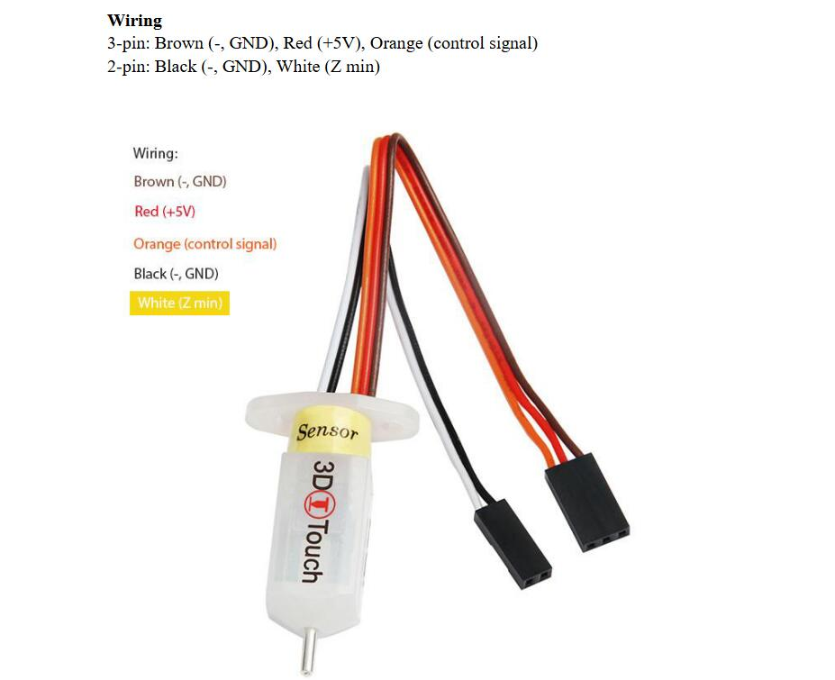

### :warning: !ATTENTION PLEASE!
The customized firmware may not be test completely, if there is any question, please feel free to let me know, thanks! email: support@zonestar3d.com

-----
### Firmware for Z9V5Pro-MK6 upgraded some features
##### Upgraded Auto Repeat Print Module
- **[:arrow_down:Z9V5ProMK6_ARPM_V1_1_2](./Z9V5ProMK6_ARPM_V1_1_2.zip)**    
- **[:arrow_down:Z9V5ProMK6_ARPM_V1_1_1](./Z9V5ProMK6_ARPM_V1_1_1.zip)**    

#### Upgraded Auto Repeat Print Module and 3DTouch/BLTouch bed leveling sensor
- **[:arrow_down:Z9V5ProMK6_3DTouch_ARPM_V1_1_2](./Z9V5ProMK6_3DTouch_ARPM_V1_1_2.zip)**  
- **[:arrow_down:Z9V5ProMK6_3DTouch_ARPM_V1_1_1](./Z9V5ProMK6_3DTouch_ARPM_V1_1_1.zip)**    
**About 3DTouch/BLTouch, please refer to [:gift: here][3DTouch_ALI] or [:gift: here][3DTouch_SPY].**   

#### Upgraded 3DTouch/BLTouch bed leveling sensor
- **[:arrow_down:Z9V5ProMK6_3DTouch_V1_1_2](./Z9V5ProMK6_3DTouch_V1_1_2.zip)**   
- **[:arrow_down:Z9V5ProMK6_3DTouch_V1_1_1](./Z9V5ProMK6_3DTouch_V1_1_1.zip)**   
- **[:arrow_down:Z9V5ProMK6_3DTouch_V1_0_2](./Z9V5ProMK6_3DTouch_V1_0_2.zip)**    
**About 3DTouch/BLTouch, please refer to [:gift: here][3DTouch_ALI] or [:gift: here][3DTouch_SPY].**   

-----
### Firmware for Z9V5Pro-MK6 upgraded 500mmx500mm build size
**About 500mmx500mm Upgrade kit, please refer to [:gift: here][UK_9V5_500_SPY] or [:gift: here][UK_9V5_500_ALI].**    
**[:book:500mmx500mm build size upgrade kit installation and use guide][GUIDE_500]**    

#### Only upgraded 500mmx500mm build size upgrade kit
- **[:arrow_down:Z9V5ProMK6Max_V1_1_2](./Z9V5ProMK6Max_V1_1_2.zip)** 
- **[:arrow_down:Z9V5ProMK6Max_V1_1_1](./Z9V5ProMK6Max_V1_1_1.zip)** 
- **[:arrow_down:Z9V5ProMK6Max_V1_0_2](./Z9V5ProMK6Max_V1_0_2.zip)** 

#### Also upgraded all motor drivers to TMC2209
- **[:arrow_down:Z9V5ProMK6Max_TMC220x_V1_1_2](./Z9V5ProMK6Max_TMC220x_V1_1_2.zip)** 
- **[:arrow_down:Z9V5ProMK6Max_TMC220x_V1_1_1](./Z9V5ProMK6Max_TMC220x_V1_1_1.zip)** 
- **[:arrow_down:Z9V5ProMK6Max_TMC220x_V1_0_2](./Z9V5ProMK6Max_TMC220x_V1_0_2.zip)** 

#### Also upgraded 3DTouch bed leveling sensor
- **[:arrow_down:Z9V5ProMK6Max_3DTouch_V1_1_2](./Z9V5ProMK6Max_3DTouch_V1_1_2.zip)** 
- **[:arrow_down:Z9V5ProMK6Max_3DTouch_V1_1_1](./Z9V5ProMK6Max_3DTouch_V1_1_1.zip)** 
- **[:arrow_down:Z9V5ProMK6Max_3DTouch_V1_0_2](./Z9V5ProMK6Max_3DTouch_V1_0_2.zip)** 

#### Also upgraded all motor drivers to TMC2209 and 3DTouch bed leveling sensor
- **[:arrow_down:Z9V5ProMK6Max_TMC220x_3DTouch_V1_1_2](./Z9V5ProMK6Max_TMC220x_3DTouch_V1_1_2.zip)** 
- **[:arrow_down:Z9V5ProMK6Max_TMC220x_3DTouch_V1_1_1](./Z9V5ProMK6Max_TMC220x_3DTouch_V1_1_1.zip)** 
- **[:arrow_down:Z9V5ProMK6Max_TMC220x_3DTouch_V1_0_2](./Z9V5ProMK6Max_TMC220x_3DTouch_V1_0_2.zip)** 

-----
### Firmware for Z9V5Pro-MK6 used ZM3E4V2 control board
Default Z9V5Pro-MK6 used a ZM3E4V3 control board, if your have replaced a ZM3E4V2.x control board, please use this firmware:
- **[:arrow_down:Z9V5ProMK6_ZM3E4V2_V1_1_5](./Z9V5ProMK6_ZM3E4V2_V1_1_5.zip)**

-----
### Wiring
Connect the 3d touch bed leveling sensor to EXP1  
   

----
#### :blue_book: [Release Note](../releasenote.md)   
For firmware version upgrade instructions, please refer to the [**release note**](../releasenote.md).

----
#### :wrench: Firmware Upload Steps 
1. Download the zip file and unzip it.
2. Copy firmware.bin to the root directory of micro-SD card, 
NOTE: !!if there is a "old_fw.bin" in the SD card, delete it first!!
3. Power off the printer and plug the micro-SD card into socket on control board
4. Power on the printer, push and hold the DC power button 3 seconds, the ZONESTAR Logo backlight will flash, wait until it goes out.
5. Push and hold the DC power button 3 seconds , until the LCD screen shows ZONESTAR LOGO.
6. Do the below step on LCD screen to initialize EEPROM: ***MENU>>Control>>Restore Defaults***

[3DTouch_ALI]: https://www.aliexpress.com/item/1005001464420529.html
[3DTouch_SPY]: https://www.zonestar3dshop.com/products/3d-touch-bltouch-bed-auto-leveling-sensor-for-3d-printers

[UK_9V5_500_ALI]: https://www.aliexpress.com/item/1005005625336328.html
[UK_9V5_500_SPY]: https://www.zonestar3dshop.com/products/zonestar-z9v5-500x500mm-large-printing-size-upgrade-kit-parts

[GUIDE_500]: https://github.com/ZONESTAR3D/Upgrade-kit-guide/tree/main/Z9V5_500x500
