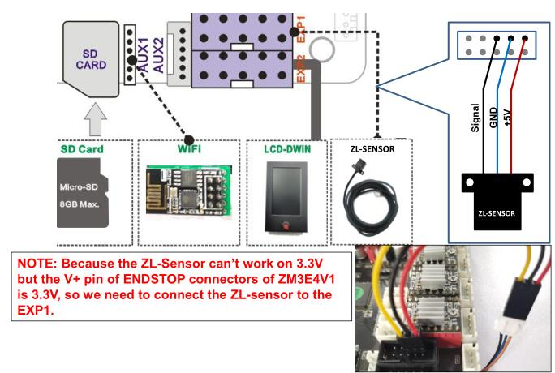

## How to wiring ZL-SENSOR
***Because Z9V5 used ZM3E4V1 and ZM3E4V2 control board, please choose corret firmware for them. Please check the serial number of your printer (a white label pasted on the power supply), if the seirial number is V1-xxxxxxxx, please choose the firmware in directory **SN-V1xxxx**, otherwise please choose the firmware in **Others**.

## Wiring for others
***connect the ZL-SENSOR to Z+ connector, the same with the orignal PL-08N***
### V3.2.5 [:arrow_down:](./Others/Z9V5Pro_ZLSENSOR_V3_2_5.zip)
### V1.3.6 [:arrow_down:](./Others/Z9V5Pro_ZLSENSOR_V1_3_6.zip)
### V1.3.2 [:arrow_down:](./Others/Z9V5Pro_ZLSENSOR_V1_3_2.zip)
### V1.2.7 [:arrow_down:](./Others/Z9V5Pro_ZLSENSOR_V1_2_7.zip)

## Wiring for V1-xxxxxxxx
***connect the ZL-SENSOR to EXP1 connector, please refer to the below picture***
### V3.2.5 [:arrow_down:](./SN-V1xxxx/Z9V5Pro_V1XXX_ZLSENSOR_V3_2_5.zip)
### V1.3.6 [:arrow_down:](./SN-V1xxxx/Z9V5Pro_V1XXX_ZLSENSOR_V1_3_6.zip)
### V1.2.7 [:arrow_down:](./SN-V1xxxx/Z9V5Pro_V1XXX_ZLSENSOR_V1_2_7.zip)

