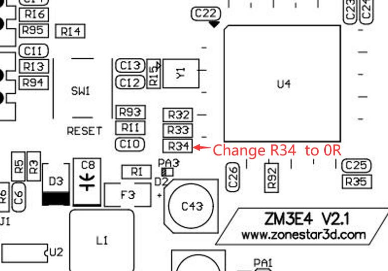
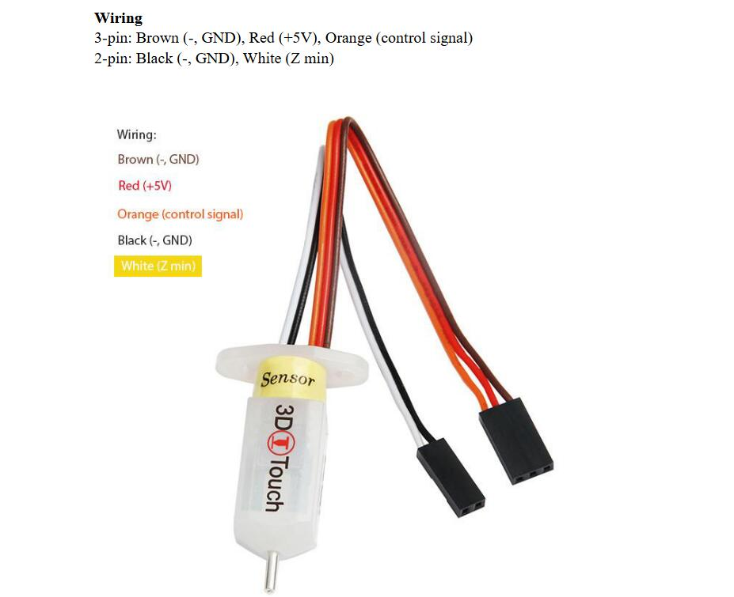

### :warning: ATTENTION PLEASE :warning: 
- You must upgrade the DWIN LCD screen menu files before upgrading the printer firmware to 2.0.0 or last version, otherwise it will cause some display issue on LCD MENU. 
- About how to upgrade the LCD MENU files of DWIN LCD, please refer to [:point_right: **here**](https://github.com/ZONESTAR3D/Upgrade-kit-guide/tree/main/TFT-LCD/LCD-DWIN).
- About the newest MENU description, please refer to  [:point_right: **here**](https://github.com/ZONESTAR3D/Upgrade-kit-guide/blob/main/TFT-LCD/LCD-DWIN/user_guide/readme.md).

----
## Firmware
### Upgraded ZL-Sensor bed leveling sensor 
- **[:file_folder: ZLSENSOR](./ZLSENSOR/readme.md)**
### Upgraded 3DTouch bed leveling sensor 
- **[:arrow_down:Z9V5Pro_3DTouch_V3_5_2](./Z9V5Pro_3DTouch_V3_5_2.zip)**
- **[:arrow_down:Z9V5Pro_3DTouch_V3_3_0](./Z9V5Pro_3DTouch_V3_3_0.zip)**
- **[:arrow_down:Z9V5Pro_3DTouch_V3_2_5](./Z9V5Pro_3DTouch_V3_2_5.zip)**
- **[:arrow_down:Z9V5Pro_3DTouch_V3_1_1](./Z9V5Pro_3DTouch_V3_1_1.zip)**
### Change Hotend Maximus work temperature to 300℃ 
- **[:arrow_down:Z9V5Pro_V3_5_2_300C](./Z9V5Pro_V3_5_2_300C.zip)**     
#### :warning: NOTE:
1. Please confirm that your hot end can support this temperature before use.
2. If your control board is the ZM3E4 V1 V2.0 or V2.1 version, please modify the resistance R34 on the motherboard to 0 ohms (originally 22 ohms), otherwise it may not be stable when the temperature exceeds 280 degrees Celsius.     

----
### Upgraded 500x500 build size kit
:warning: V3.5.2 change to keep Z motor powered after print is finished, avoid the heat bed to auto drop down.
#### Only upgraded 500x500 build size kit
- **[:arrow_down:Z9V5ProMax_V3_5_2](./Z9V5ProMax_V3_5_2.zip)**
- **[:arrow_down:Z9V5ProMax_V3_5_1](./Z9V5ProMax_V3_5_1.zip)**
- **[:arrow_down:Z9V5ProMax_V3_3_0](./Z9V5ProMax_V3_3_0.zip)**
#### Upgraded Dual Gear Extruders (2x left hand and 2x right hand) too
- **[:arrow_down:Z9V5ProMax_BMGLR_V3_5_2](./Z9V5ProMax_BMGLR_V3_5_2.zip)**
#### Upgraded 3DTouch bed leveling sensor too
- **[:arrow_down:Z9V5ProMax_3DTouch_V3_5_2](./Z9V5ProMax_3DTouch_V3_5_2.zip)**
- **[:arrow_down:Z9V5ProMax_3DTouch_V3_5_1](./Z9V5ProMax_3DTouch_V3_5_1.zip)**
- **[:arrow_down:Z9V5ProMax_3DTouch_V3_3_0](./Z9V5ProMax_3DTouch_V3_3_0.zip)**
#### Upgraded Dual Gear Extruders (2x left hand and 2x right hand) and 3DTouch bed leveling sensor too
- **[:arrow_down:Z9V5ProMax_3DTouch_BMGLR_V3_5_2](./Z9V5ProMax_3DTouch_BMGLR_V3_5_2.zip)**

----
## Wiring

   

----
#### :blue_book: [Release Note](../releasenote.md)   
For firmware version upgrade instructions, please refer to the [**:book: release note**](../releasenote.md).

----
#### :wrench: Firmware Upload Step 
1. Download the zip file and unzip it.
2. Copy firmware.bin to the root directory of micro-SD card, 
NOTE: !!if there is a "old_fw.bin" in the SD card, delete it first!!
3. Power off the printer and plug the micro-SD card into socket on control board
4. Power on the printer, push and hold the DC power button 3 seconds, the ZONESTAR Logo backlight will flash, wait until it goes out.
5. Push and hold the DC power button 3 seconds , until the LCD screen shows ZONESTAR LOGO.
6. Do the below step on LCD screen to initialize EEPROM: ***MENU>>Control>>Restore Defaults***

