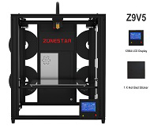
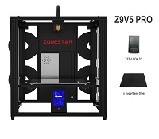
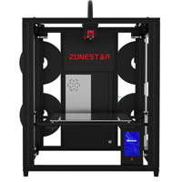

# Z9V5
**Z9V5 equiped with LCD12864 LCD screen and hotbed sticker**  
  

# Z9V5Pro
**Z9V5Pro equiped with a 4.3" TFT-LCD screen and a glass print platform**  
  

# Z9V5Pro-MK3
***what's different on Z9V5Pro-MK3 with Z9V5Pro(-MK1/MK2)**
1. Used TMC2225 on all extrdur motor drivers.
2. Used ZLsensor to replace PL-08N on bed leveling sensor.        
  

# Firmware Upload Steps:
1. Download the zip file and unzip it
1. Copy firmware.bin to the root directory of Micro-SD card, 
NOTE: !!if there is a "old_fw.bin" in the SD card, delete it first!!
1. Power off the printer and plug the Micro-SD card into socket on control board
1. Power on the printer, push the power button and wait about 30 seconds
1. Do the below step on LCD screen to initialize EEPROM after upload firmware:
    `MENU>>control>>Restore Defaults`
