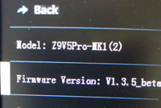

## Firmware download link
- [**:point_right: Firmware for Z9V5Pro-MK1 & Z9V5Pro-MK2**](./Z9V5Pro/readme.md)
- [**:point_right: Firmware for Z9V5Pro-MK3**](./Z9V5Pro-MK3/readme.md)
- [**:point_right: Firmware for Z9V5Pro-MK4**](./Z9V5Pro-MK4/readme.md)
- [**:point_right: Firmware for Z9V5Pro-MK5**](./Z9V5Pro-MK5/readme.md)

### :bell: HINT
1. **All the firmware listed in this file are for the motherboard of the machine.**  
2. **As long as the firmware you choose is for Z9V5Pro, even if you uploaded a wrong firmware (such as your machine model is MK2 but you upgraded a firmware for MK3), the LCD Screen can display normally, you can upload the firmware for MK2 again.**
3. **Some newer versions of machine firmware require upgraded the LCD display image library too, otherwise some item characters in LCD menus may not be displayed properly. For detail, please read the "release note" on the firmware download page.**

### How to upload firmware to Z9V5Pro
Please following the below steps to upload the firmware: 
1. Download the zip file and unzip it, you can get a ***firmware.bin*** file.
2. Copy that ***firmware.bin*** to the root directory of Micro-SD card.    
:bell: **We suggest you format the SD card or deleted all files in SD card before copy**.      
3. Power off the printer and plug the Micro-SD card into socket on control board.
4. Power on the printer, **push and hold** the DC power button (***the little round metal button***), release it until the LOGO light stop flash.
5. **Push and hold** the DC power button again, until you can see the LCD screen shows "ZONESTAR" logo page.
6. Do ***MENU>>Control>>Restore Defaults*** LCD screen to reset settings.  

-----
### :bulb: How do I know if my machine is MK1, MK2, MK3 or MK4?
**About what's different between Z9V5Pro-MK1/MK2/MK3/MK4, please refer to [:point_right: here](https://github.com/ZONESTAR3D/Z9/tree/main/Z9V5)**.  
### Method 1. Check serial number of your printer:
You can distinguish by serial number, there is a white lable on the power supply wrote down the serial number.      
    
- **Z9V5Pro-MK1:** Serial Number is **xxxxxxxxxx**      
- **Z9V5Pro-MK2:** Serial Number is **V1-xxxxxxxxxx** and **V2-xxxxxxxxxx**    
- **Z9V5Pro-MK3:** Serial Number is **MK3-xxxxxxxxxx**       
- **Z9V5Pro-MK4:** Serial Number is **MK4-xxxxxxxxxx**    
- **Z9V5Pro-MK5:** Serial Number is **MK5-xxxxxxxxxx**     

### Method 2. Check the original firmware version:
You can check the printer name from the LCD screen too, see "Menu>>**Info>>Model**", refer to the below picture:   
      
- **Z9V5Pro-MK1** and **Z9V5Pro-MK2**: model is **Z9V5Pro** or **Z9V5Pro-MK1(2)**  
- **Z9V5Pro-MK3**: model is **Z9V5Pro-MK3**    
- **Z9V5Pro-MK4**: model is **Z9V5Pro-MK4**    
- **Z9V5Pro-MK5**: model is **Z9V5Pro-MK5**    

-----
### Recommanded Upgrade Features
- **Non-Mix Color hotend**[:gift:](https://www.aliexpress.com/item/3256802765462947.html) [:gift:](https://bit.ly/39qDtKp)
- **New Mixing Color hotend** [:gift:](https://bit.ly/3QhWJtf) [:gift:](https://www.aliexpress.com/item/1005004547646195.html)
- **WiFi wireless control** [:gift:](https://bit.ly/3rB7mx1)  [:gift:](https://www.aliexpress.com/item/3256802192236737.html)   
- **PEI Bed Sticker** [:gift:](http://bit.ly/3GbI9Sr)

