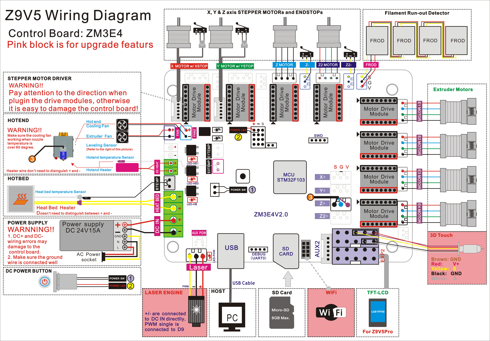

## Firmware for Z9V5  
### :file_folder: [Firmware bin file](./bin/)
Bin file is the complied file of the firmware, you can upload this file to the control board of 3d printer from SD card directly.     
About how to choose the correct firmware for your kit, please refer to [:point_right: **here**](./bin/readme.md).

### :file_folder:  [Firmware source code](https://github.com/ZONESTAR3D/source-code-for-3d-printer)
Z9V5 is open source of firmware, if you are interested in study, modify and build the firmware by yourself, please refer to [:point_right: **here**](https://github.com/ZONESTAR3D/source-code-for-3d-printer).  

### Wiring block

### Wiring diagram

-----
### Recommanded Upgrade Features
- **Non-Mix Color hotend**[:gift:](https://www.aliexpress.com/item/3256802765462947.html) [:gift:](https://bit.ly/39qDtKp)
- **New Mixing Color hotend** [:gift:](https://bit.ly/3QhWJtf) [:gift:](https://www.aliexpress.com/item/1005004547646195.html)
- **WiFi wireless control** [:gift:](https://bit.ly/3rB7mx1)  [:gift:](https://www.aliexpress.com/item/3256802192236737.html)   
- **PEI Bed Sticker** [:gift:](http://bit.ly/3GbI9Sr)
