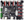

# Firmware for ZONESTAR Z9  
## :file_folder: [Z9V5Pro-MK4](./Z9V5/bin/Z9V5Pro-MK4)
### Default configurations:
- Control board: [ZM3E4 (32 bits control board)](#zm3e4)
- Extrude system: [Titan Extrusion feeder](https://www.aliexpress.com/item/3256801491924265.html) + [**4-IN-1-OUT Non-Mix Color hotend**](https://github.com/ZONESTAR3D/Upgrade-kit-guide/tree/main/HOTEND/E4%204-IN-1-OUT%20Non-Mixing%20Color%20Hotend).
- Bed Auto leveling sensor: [PL-08N](https://www.aliexpress.com/item/2255800409994958.html)
- Motor drivers: 8x [TMC2225](https://www.aliexpress.com/item/3256803084406467.html) motor drivers
- LCD Screen: [4.3" TFT-LCD](https://github.com/ZONESTAR3D/Upgrade-kit-guide/tree/main/TFT-LCD/LCD-DWIN)   

### Recommanded Upgrade Features 
- **Mixing Color hotend** [:gift:](https://bit.ly/3QhWJtf) [:gift:](https://www.aliexpress.com/item/1005004547646195.html)
- **Non-Mix Color hotend**[:gift:](https://www.aliexpress.com/item/3256802765462947.html) [:gift:](https://bit.ly/39qDtKp)
- **WiFi wireless control** [:gift:](https://bit.ly/3rB7mx1)  [:gift:](https://www.aliexpress.com/item/3256802192236737.html)   
- **PEI Bed Sticker** [:gift:](http://bit.ly/3GbI9Sr)

## :file_folder: [Z9V5Pro-MK3](./Z9V5/bin/Z9V5Pro-MK3)
### Default configurations:
- Control board: [ZM3E4 (32 bits control board)](#zm3e4)
- Extrude system: [Titan Extrusion feeder](https://www.aliexpress.com/item/3256801491924265.html) + [4-IN-1-OUT Mix Color hotend (M4V4)](https://github.com/ZONESTAR3D/Upgrade-kit-guide/tree/main/HOTEND/M4%20%204-IN-1-OUT%20Mixing%20Color%20Hotend)
- Bed Auto leveling sensor: [ZL-SENSOR](https://www.aliexpress.com/item/3256802678996718.html)
- Motor drivers: 8x [TMC2225](https://www.aliexpress.com/item/3256803084406467.html) motor drivers
- LCD Screen: [4.3" TFT-LCD](https://github.com/ZONESTAR3D/Upgrade-kit-guide/tree/main/TFT-LCD/LCD-DWIN)  
### Recommanded Upgrade Features
- **Non-Mix Color hotend**[:gift:](https://www.aliexpress.com/item/3256802765462947.html) [:gift:](https://bit.ly/39qDtKp)
- **New Mixing Color hotend** [:gift:](https://bit.ly/3QhWJtf) [:gift:](https://www.aliexpress.com/item/1005004547646195.html)
- **WiFi wireless control** [:gift:](https://bit.ly/3rB7mx1)  [:gift:](https://www.aliexpress.com/item/3256802192236737.html)   
- **PEI Bed Sticker** [:gift:](http://bit.ly/3GbI9Sr)

## :file_folder: [Z9V5Pro-MK1&MK2](./Z9V5/bin/Z9V5Pro)
### Default configurations:
- Control board: [ZM3E4 (32 bits control board)](#zm3e4)
- Extrude system: [Titan Extrusion feeder](https://www.aliexpress.com/item/3256801491924265.html) + [4-IN-1-OUT Mix Color hotend (M4V3)](https://github.com/ZONESTAR3D/Upgrade-kit-guide/tree/main/HOTEND/M4%20%204-IN-1-OUT%20Mixing%20Color%20Hotend)
- Bed Auto leveling sensor: [PL-08N](https://www.aliexpress.com/item/2255800409994958.html)
- Motor drivers:
  - 4x [TMC2225](https://www.aliexpress.com/item/3256803084406467.html) used on XYZ(2) axis steps motors 
  - 4x [A4988](https://www.aliexpress.com/item/2255800771058461.html) used on extruder steps motors
- LCD Screen: 
 - Z9V5: [128x64 dots LCD screen](https://www.aliexpress.com/item/2255801130809506.html)   
 - Z9V5Pro: [4.3" TFT-LCD](https://github.com/ZONESTAR3D/Upgrade-kit-guide/tree/main/TFT-LCD/LCD-DWIN)      
### Recommanded Upgrade Feature
- **Non-Mix Color E4 hotend**[:gift:](https://www.aliexpress.com/item/3256802765462947.html)  [:gift:](https://bit.ly/39qDtKp)
- **New Mixing Color hotend** [:gift:](https://bit.ly/3QhWJtf) [:gift:](https://www.aliexpress.com/item/1005004547646195.html)
- **WiFi wireless control** [:gift:](https://bit.ly/3rB7mx1)  [:gift:](https://www.aliexpress.com/item/3256802192236737.html)   
- **PEI Bed Sticker** [:gift:](http://bit.ly/3GbI9Sr)

## :file_folder:[Z9M4](./Z9M4)
### Default configurations:
- Control board: [ZM3E4 (32 bits control board)](#zm3e4)
- Extrude system: [Titan Extrusion feeder](https://www.aliexpress.com/item/3256801491924265.html) + [4-IN-1-OUT Mix Color hotend (M4V2)](https://github.com/ZONESTAR3D/Upgrade-kit-guide/tree/main/HOTEND/M4%20%204-IN-1-OUT%20Mixing%20Color%20Hotend).
- Motor drivers: 8x [A4988](https://www.aliexpress.com/item/2255800771058461.html) motor drivers
- LCD Screen: [128x64 dots LCD screen](https://www.aliexpress.com/item/2255801130809506.html)
#### Upgradeable configurations:
- [Dual Gear extruders](https://www.aliexpress.com/item/3256803287046246.html)
- [BL-Touch](https://www.aliexpress.com/item/3256801278105777.html)/[ZLSensor](https://www.aliexpress.com/item/3256802678996718.html) bed leveling sensor
- [TMC motor drivers](https://www.aliexpress.com/item/3256803218812844.html)
- [4.3" TFT-LCD Screen](https://github.com/ZONESTAR3D/Upgrade-kit-guide/tree/main/TFT-LCD/LCD-DWIN)
- [WiFi wireless control](https://www.aliexpress.com/item/3256802192236737.html) 
- [Dual Z drivers](https://www.aliexpress.com/item/3256801447052364.html)

## :file_folder: [Z9M3](./Z9M3)
### Default configurations: 
- Control board: [ZRIBV6 (8 bits control board)](#zribv6)
- Extrude system: 3 Extrusion feeder + 3-IN-1-OUT hotend.
- From Z9F, it upgraded to [Titan Extrusion feeder](https://www.aliexpress.com/item/3256801491924265.html)
- Motor drivers: 8x [A4988](https://www.aliexpress.com/item/2255800771058461.html) motor drivers
- LCD Screen:[128x64 dots LCD screen](https://www.aliexpress.com/item/2255801130809506.html)
#### Upgradeable configurations:
- [Upgrade to Z9M4](https://www.aliexpress.com/item/3256803218812844.html)
- [ZM3E4 32 bit control board](https://www.aliexpress.com/item/3256801114422275.html)
- [Titan extruder](https://www.aliexpress.com/item/3256801491924265.html)
- bed leveling sensor [BL-Touch](https://www.aliexpress.com/item/3256801278105777.html) or [ZLSensor](https://www.aliexpress.com/item/3256802678996718.html) 
- [TMC Silent motor drivers](https://www.aliexpress.com/item/3256803218812844.html)
- ~~3.5" TFT-LCD Screen(with touch screen)~~
- [4.3" TFT-LCD Screen](https://github.com/ZONESTAR3D/Upgrade-kit-guide/tree/main/TFT-LCD/LCD-DWIN)
- [WiFi wireless control](https://www.aliexpress.com/item/3256802192236737.html) . ***MUST to upgrade ZM3E4 32 bits control boar first***   
- [Dual Z drivers](https://www.aliexpress.com/item/3256801447052364.html)

## :file_folder:[Z9M2](./Z9M2)
### Default configurations:
- Control board: [ZRIBV6 (8 bits control board)](#zribv6)  
- Extrude system: 2 Extrusion feeder + 2-IN-1-OUT hotend
- Motor drivers: [A4988](https://www.aliexpress.com/item/2255800771058461.html)   
- LCD Screen: [128x64 dots LCD screen](https://www.aliexpress.com/item/2255801130809506.html)

## About the control board:
### ZRIBV6

### [ZM3E4](https://www.aliexpress.com/item/3256801114422275.html)
[**Upgrade to ZM3E4**](https://www.aliexpress.com/item/1005001300737027.html)  

