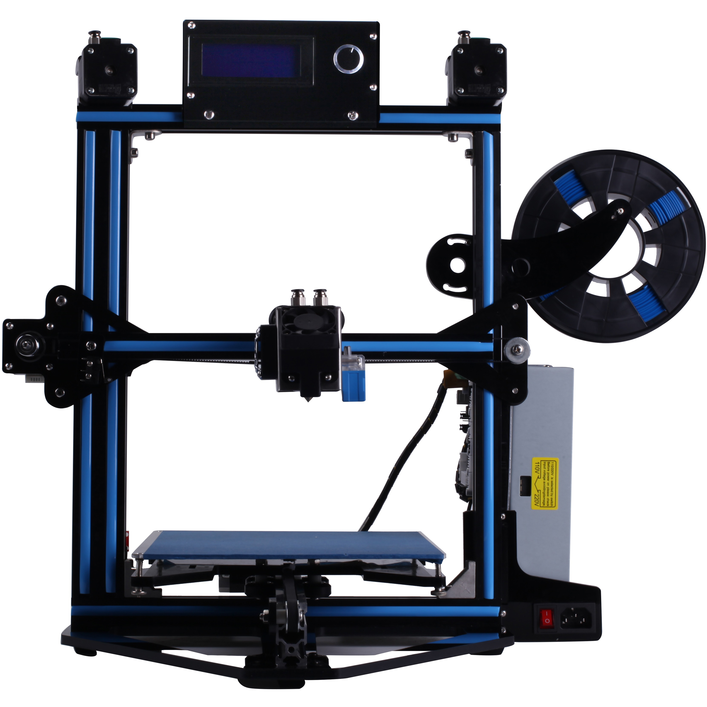

## D805S 3D printer

---------
## Firmware List
### [D805S: Single extruder](./D805S/) 
:arrow_down:[Download ZIP](./D805S.zip)
### [D805SR2: Dual extruder](./D805SR2/) 
:arrow_down:[Download ZIP](./D805SR2.zip)
### [D805SM2: Dual extruder mixing color](./D805SM2/) 
:arrow_down:[Download ZIP](./D805SM2.zip)

---------
### For ZRIB & ZMIB control board  
1. Download firmware upgrade tool: [:arrow_down:](./Firmware_Upload_tool_for_ZRIB_ZMIB/Arduloader.zip).
2. Download HEX file and copy the hex file to the same directory with the tool.   
3. Unzip "Arduloader.zip" , there is a user guide"Arduloader_user_guide.pdf" in this zip file, please read it. 
4. Connect the printer to your PC, please make sure the driver has been installed correctly. 
5. Follow "Arduloader_user_guide.pdf" to upload the firmware to your control board.
