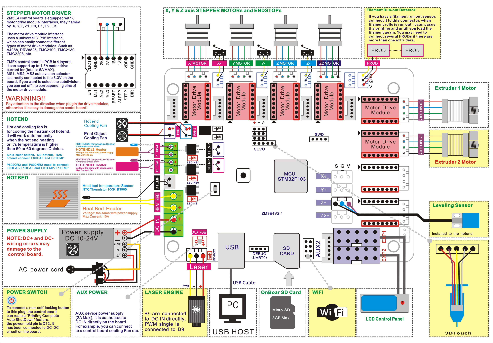

### How to upload firmware to ZM3E4 control board
Please following the below steps to upload the firmware: 
1. Download the zip file and unzip it, you can get a ***firmware.bin*** file.
2. Copy that ***firmware.bin*** to the root directory of Micro-SD card.    
:bell: **We suggest you format (FAT32) the SD card before copy**.      
3. Power off the control board and plug the Micro-SD card into socket on control board.
4. Power on the control board and wait about 30 seconds (a LED will flash on the control board).
5. Power on the control board again.
6. Do ***Configuaration>>Restore Defaults*** on LCD MENU to reset settings.  

-----
## Firmware
### [:arrow_down: P802N_ZM3E4_TCM220x](./P802N_ZM3E4_TCM220x.zip)
P802N with defaule extruder, used TMC2208 on all motors (X/Y/Z1/Z2/E0)
### [:arrow_down: P802N_ZM3E4_TCM2225_3DTouch](./P802N_ZM3E4_TCM2225_3DTouch.zip)
P802N with defaule extruder, used TMC2225 on all motors (X/Y/Z1/Z2/E0), upgraded 3DTouch bed leveling sensor
### [:arrow_down:P802NM2_ZM3E4_TMC2225@XYZ](./P802NM2_ZM3E4_TMC2225%40XYZ.zip)
P802N with 2-IN-1-OUT mix color hotend, used TMC2225 on X/Y/Z1/Z2 motors and A4988 on extruder motors
### [:arrow_down:P802NM2_ZM3E4](./P802NM2_ZM3E4.zip)
P802N with 2-IN-1-OUT mix color hotend, used A4988 on all motors
### [:arrow_down:P802NM2_ZM3E4_NonZEND](./P802NM2_ZM3E4_NonZEND.zip)
P802N with 2-IN-1-OUT mix color hotend, used A4988 on all motors, without Z ENDSTOP (connect bed leveling sensor to Z-MIN).
### [:arrow_down:P802NM2_ZM3E4_NonZEND_TMC2225@XYZ](./P802NM2_ZM3E4_NonZEND_TMC2225%40XYZ.zip)
P802N with 2-IN-1-OUT mix color hotend, used TMC2225 on X/Y/Z1/Z2 motors and A4988 on extruder motors, without Z ENDSTOP (connect bed leveling sensor to Z-MIN).

-----
## Wiring Diagram
